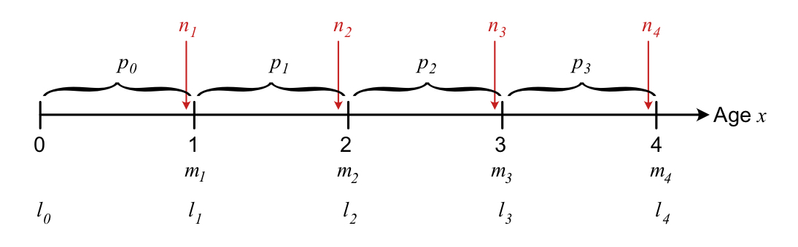
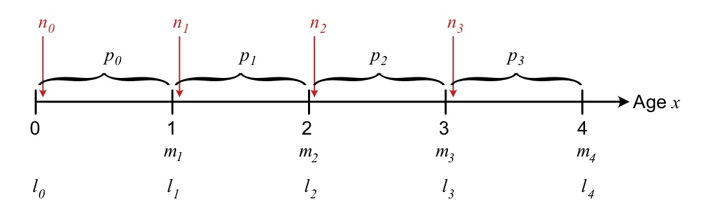
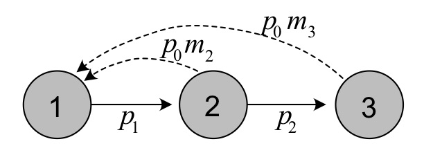

# Age-structured matrix population models {#s03-MatrixModels}

Matrix models make it possible to work with systems of multiple equations simultaneously, which is what we need to describe the growth of structured populations. For instance, if we study a long-lived species with 50 age classes, it is very cumbersome to write down the growth equations for all of the 50 age classes. With a matrix model we need only one equation to keep track of the growth of all of stages simultaneously.  

This chapter will deal with age-structured matrix models and introduce methods for calculating key properties of life history and population growth. Chapter \@ref{s04-stage} will introduce more general stage structured models, and we will see that the methods introduced here for age-structured populations are applicable also to these cases.

The main 'ingredient' of an age-structured matrix model is the Leslie matrix, which contains all the information necessary to project the growth of each age class over time.  Several life history parameters can also be calculated directly from this matrix, including the long-term population growth rate $\lambda$. 
<br>

## Learning goals 


* Define a Leslie matrix for age-structured populations, and its two main components.

* Explain the differences between a pre- and post-reproductive census.

* Show how a Leslie matrix is related to the life table.

* Draw a life cycle graph and explain how it is related to the Leslie matrix.

* Calculate asymptotic parameters from a matrix model (using projection or eigen analysis), and explain their biological meaning.

* Calculate lifetime reproduction, generation time and life expectancy from the Leslie matrix and its main components.

* Calculate sensitivities and elasticities of $\lambda$ with respect to projection matrix elements or underlying parameters.

* Do an LTRE analysis to understand the difference in the long-term growth rate in two different environments.

<br>


 

##  Age-structured growth
In this section we will define the growth of each age class as a function of the annual survival probability and fertility, and introduce the matrix equation to describe this growth.  In the next sections we will see how the age-structured matrix model is connected to life tables, and how it can be described by a life cycle graph. The last sections present important calculations that can be done with a matrix model.

We will denote the first class as class 1, the second as class 2, etc., but as we will see in section \@ref(census), the definition of the parameters of survival and reproduction depend on census time (when the population is counted within each time step). To keep track of the number of individuals in each of the age classes over time, we define the following **population vector** $\mathbf{n}_t$ of individuals in age class 1 to $k$:


\begin{align}
\mathbf{n}_t=\left[\begin{matrix} n_1(t) \\ n_2(t)\\ \vdots \\ n_k(t) \end{matrix} \right].
(\#eq:popvec)
\end{align}

<br>

The total population size at time $t$ is the sum of this vector,  $N_t=\sum_{j=1}^kn_j(t)$ (note that we now use $j$ or $i$ as index instead of $x$, following conventional notation for matrix models). Let $s_j$ describe the survival probability of individuals in age class $j$ to the next time step, and $f_j$ the number of offspring produced by each individual in age class $j$ that enter age class 1 at time $t+1$. Importantly, $s_j$ and $f_j$ of the Leslie matrix are *not the same* as the age-specific survival probability $p_j$ and fecundity $m_j$ (see section \@ref(census)).  

The growth of age class 1 (offspring) from one time step to the next is then given by 

\begin{equation}
n_1(t+1)=f_1n_1(t)+f_2n_2(t)+\ldots +f_kn_k(t),
(\#eq:AgeGrowth1)
\end{equation}

while the growth of the other age classes is given by

\begin{align}
\begin{split}
n_2(t+1)&=s_1n_1(t),\\
n_3(t+1)&=s_2n_2(t),\\
\vdots \\
n_k(t+1)&=s_{k-1}n_{k-1}(t).\\
\end{split}
(\#eq:AgeGrowth2)
\end{align}

<br> 


Together, theses equations constitute a system of linear equations, which we can describe with a matrix model:

\begin{align}
\begin{split}
\mathbf{n}_{t+1}&=\mathbf{A}\mathbf{n}_t\\
\left[\begin{matrix} n_1 \\n_2 \\ \vdots \\  \\ n_k   \\  \end{matrix}\right]_{t+1}&=\left[\begin{matrix} f_1 & f_2 && \cdots & f_k \\ s_1 &0 && \cdots &0\\ 0 &s_2 & &\cdots &0\\ \vdots& &\ddots&&\vdots\\ 0 &\cdots&0 & s_{k-1} &0  \\  \end{matrix}\right]\left[\begin{matrix} n_1 \\n_2 \\ \vdots \\  \\ n_k   \\  \end{matrix}\right]_{t}.
\end{split}
(\#eq:LeslieGrowth)
\end{align}


<br>

This is the age-structured version of the exponential growth model of an unstructured population (section \@ref(s01-Exponential)). The matrix  $\mathbf{A}$ is a square matrix (same number of rows and columns), of dimension $k \times k$, where $k$ is the number of age classes. It is named a **Leslie matrix** after the work of Leslie [-@Leslie1; -@Leslie2], and the more general term which also applies to other kinds of structure is a  **projection matrix**.  The elements of the first row of $\mathbf{A}$ represent the production of offspring to next year's population from each of the age classes. Here we refer to these elements as **fertility coefficients** or simply fertilities, while the **survival coefficients** are located along the sub-diagonal of the Leslie matrix. In the final age class, no individuals survive until the next time step, but individuals can reproduce and contribute with a number $f_k$ to next year's age class 1.  

<br>

The Leslie matrix can be decomposed as the sum of a **survival matrix** $\mathbf{U}$ and a **fertility matrix** $\mathbf{F}$:

\begin{align}
\begin{split}
\mathbf{A}&=\mathbf{U}+\mathbf{F}\\
\left[\begin{matrix} f_1 & f_2 && \cdots & f_k \\ s_1 &0 && \cdots &0\\ 0 &s_2 & &\cdots &0\\ \vdots& &\ddots&&\vdots\\ 0 &\cdots&0 & s_{k-1} &0  \\  \end{matrix}\right] &= \left[\begin{matrix} 0 & 0 && \cdots & 0 \\ s_1 &0 && \cdots &0\\ 0 &s_2 & &\cdots &0\\ \vdots& &\ddots&&\vdots\\ 0 &\cdots&0 & s_{k-1} &0  \\  \end{matrix}\right] \left[\begin{matrix} f_1 & f_2 && \cdots & f_k \\0  &0 && \cdots &0\\ 0 &0 & &\cdots &0\\ \vdots& &\ddots&&\vdots\\ 0 &\cdots&0 & 0 &0  \\  \end{matrix} \right]
\end{split}
(\#eq:LeslieSplit)
\end{align}

<br>

These two sub-matrices are used in the calculations of the net reproductive rate $R_0$ and generation time $G$ (section \@ref(asymptotic)). In chapter \@ref(s04-Stage) we will further decompose these two matrices into components describing survival, fertility and stage transitions.

<br>

### Creating a Leslie matrix in R {#LeslieR}

The following R function creates a Leslie matrix from vectors of survival $\mathbf{s}$ and fertility $\mathbf{f}$ (the vectors must have the same length, corresponding to the number of age classes). The final element of the survival vector should be 0 if the model is purely age-structured (otherwise, individuals are allowed to accumulate in the final class, which is a commonly used extension of age structured models).

<br>

```{r}
Create.Amat <- function(Svec, Fvec){
  k <- length(Svec)
  MatA<- matrix(0,k,k)
  MatA[1,] <- Fvec 
  for(i in 1:(k-1)){
    MatA[i+1,i] <- Svec[i]
  }
  #Individuals can accumulate if Svec[k]>0:
  MatA[k,k] <- Svec[k] 
  MatA
  }
```


<br>

## Pre- and post-reproductive census{#census}

The Leslie matrix depends on coefficients of fertility, $f_j$, and survival probabilities  $s_j$. How these coefficients are linked to the life table depends on the *census type* of the matrix model, in other words at what time point the population is counted during each time step For a birth-pulse population (where individuals reproduce once per time step), there are two main census types: Pre- and post-reproductive* census. As the names indicate, they assume that the population is counted either right before (pre) or right after (post) reproduction. 

Census time is important because a lot can happen to a population also within the time intervals of the model.  The age-specific parameters describing fecundity ($m_x$) and survival ($l_x$, $p_x$) as a function of actual age $x$ are the same regardless of census time. But the fertility and survival coefficients of the Leslie matrix ($s_j$, $f_j$) will be different depending on census - see definitions below.  

In general, the size of age class 1 is larger in the post-reproductive census than with pre-reproductive, because individuals in this class are newborn. For any age-structured population with a positive growth rate, the stable age structure (proportion of individuals of each age) will always decline with age.   
 
  
We assume that the population reproduces only once per year. But different species can have very different modes of reproduction, depending on their life history and environments. Some tropical species can reproduce at all times through the year. Bacteria also reproduce (divide) continuously.  Other species can have more than one reproductive events each season, or reproduce only every other season (or even more rarely).  It is possible to account for these different types of reproductive mode in a matrix model [@Caswell1], but that requires a different way to estimate the age-specific  survival and fertility coefficients, which is beyond the scope of this course.

Below we go through the parameters of a pre- and post-reproductive census in more detail, using the bird example.

<br>

### Pre-reproductive census


<br>

 

```{r fig3, fig.cap='Overview of the timing of different events of survival and reproduction within each time step, for a pre-reproductive census.', echo=FALSE, message=FALSE, warning=FALSE, out.width = '100%'}

```

 
<br>


With a **pre-reproductive census**, offspring will be nearly 1 year old when counted, and age classes correspond to the actual age at counting (e.g. individuals in age class 1 are 1 year old when counted), so that $s_j=p_j$. The fertility coefficients are then given by $f_j=p_0m_j$, the product of the fecundity  $m_j$ and the first year survival probability $p_0$. 

<br>

#### Bird example{-}

Using the bird example introduced in section \@ref(bird), the Leslie matrix for a pre-reproductive census is given by

 
<br>

\begin{align}
\begin{split}
\mathbf{A}=\left[\begin{matrix} f_1 & f_2 &f_3  \\ s_1 &0&0\\ 0 & s_2 &0  \\  \end{matrix}\right]=\left[\begin{matrix} 0 & p_0m_2 &p_0m_3  \\ p_1 &0&0\\ 0 & p_2 &0  \\  \end{matrix}\right]=\left[\begin{matrix} 0 &0.6 &1.2  \\ 0.9 &0&0\\ 0 & 0.6 &0  \\  \end{matrix}\right].
\end{split}
(\#eq:Prerep)
\end{align}


<br>
 
The classes of this matrix corresponds to age 1, 2, and 3. We do not 'see' the 0-year olds in the matrix model, but the survival probability $p_0$ enters the fertility coefficients.
 
In R, we can define the matrix as follows: 

```{r}
Abird.pre <- Create.Amat(Svec <- c(.9, .6, 0), Fvec= c(0, .6, 1.2))  
```

 <br>

### Post-reproductive census

 
```{r fig4, fig.cap='Overview of the timing of different events of survival and reproduction within each time step, for a post-reproductive census.', echo=FALSE, message=FALSE, warning=FALSE, out.width = '100%'}

```

 
<br>

With a **post-reproductive census**, the population is counted right after reproduction.  In this case, age class 1 consists of newborn individuals (age 0), and individuals in age class $j$ have the actual age $j-1$, so that $s_j=p_{j-1}$.  The  fertility coefficient $f_j$ now depends on survival of the parent from last time step $s_{j-1}$, and on fecundity $m_{j}$ of the age $j$, since individuals reproduce right before next census. Thus, the fertility coefficient of the Leslie matrix is now $f_j=p_{j-1}m_{j}$. This definition of fertilities can be counter-intuitive, as the contribution from a given age class $j$ to next year's offspring depends on survival from the previous (actual) age $p_{j-1}$. 
 
 
<br>

#### Bird example{-}

For the bird example, we get the following Leslie matrix with post-reproductive census:

<br>

\begin{align}
\begin{split}
\mathbf{A}=\left[\begin{matrix} f_1 & f_2 &f_3  \\ s_1 &0&0\\ 0 & s_2 &0  \\  \end{matrix}\right]=\left[\begin{matrix} 0 & p_1m_2 &p_2m_3  \\ p_0 &0&0\\ 0 & p_1 &0  \\  \end{matrix}\right]=\left[\begin{matrix} 0 &2.7 &3.6  \\ 0.2 &0&0\\ 0 & 0.9 &0  \\  \end{matrix}\right].
\end{split}
(\#eq:Postrep)
\end{align}


<br>

Note that each class of this matrix corresponds to age 0, 1, and 2. Thus, in this case we do not 'see' the 3-year olds as a separate class, but their fecundity defines fertility coefficient in the third class.

In R, we can define this matrix as follows:

```{r}
Abird.post <- Create.Amat(Svec <- c(.2, .9, 0), Fvec= c(0, 2.7, 3.6))  
```

 <br>

### Avoiding mistakes 
 
It turns out that mistakes in constructing the projection matrix are quite common in the ecological literature [@Kendall8], and issues with census time often play a role here. Mistakes are easily made, since keeping track of age classes versus actual age requires accurate 'book-keeping', especially with a post-reproductive census. Mistakes are also more common for post-reproductive census models than pre-reproductive census models [@Kendall8].  

Contributing to the confusion, the terminology of matrix models is not consistent in the literature. For instance, what we have defined as the 'fertility coefficients' $f_j$ is by some authors referred to as 'fecundity' ($m_j$ in our notation). Therefore, some authors mistakenly did not include survival in their fertility coefficients. Finally, there is  no general consensus on whether to use 0 or 1 as index for the first age class when a post-reproductive census is used (note that we always use 1 as the index, regardless of census time), and this choice can affect the limits and indexing in different calculations (e.g.  the Euler-Lotka equation). 

The main recommendation to avoid such errors when constructing a matrix model, is to take your time and make sure you have defined each element of the matrix model and its biological meaning. One way to double check that you have obtained the right coefficients is to compare a pre- and post-reproductive census model and Leslie matrix, and check that $\lambda$ calculated from the matrix (section\@ref(asymptotic)) is the same for the two cases. If it differs, at least one of the models has an error. It can also be helpful to draw a life cycle graph (see section \@ref(life-cycle-graph)).

The long-term population growth rate $\lambda$ should be the same regardless of census time, and for age structured models the same is true for $R_0$ and generation time $G$ (section\@ref(asymptotic)). But other properties will change between census times, such as the stable stage structure and reproductive value. The difference can be large, since many changes can occur within time steps. This is particularly true for species producing a many offspring per reproductive event, with low offspring survival. A female cod, for instance, can produce millions of eggs, but only a few will survive the first year.  If we count a cod population right after spawning (post-reproductive census), the fertilized eggs would constitute a very high proportion of the population (practically the entire population). If we instead counted the population right before spawning (pre-reproductive census), the proportion of age 1 offspring would not be as high.
 
<br>

 
## Life cycle graph


 <br>
 
 <center>

```{r Birdfig, fig.cap='Life cycle graph for the songbird example, with a pre-reproductive census.', echo=FALSE, out.width = '60%'}

```

</center>


<br>

A structured model can be represented in different ways. You have already seen two examples for age-structured populations: A life table and a matrix model.  A third representation, which is a helpful visual tool, is the life cycle graph. This is particularly useful for more complex structures than age structure, with many possible transitions among stages. For age structured popualtoins it can be a useful tool to keep track of parameters for the different census times.

A life cycle graph gives an overview of the possible  transitions among age classes each time step.  For age structured populations, these transitions are quite simple, as they only consist of of survival from one age class to the next, and reproductive contributions from each age class to next year's offspring.  

Figure \@ref(fig:Birdfig)  shows the life cycle graph for the bird example introduced in section \@ref(bird), for a pre-reproductive census. Each circle represent one age class of the matrix model, and since this is pre-reproductive census age class 1 consists of individuals at age 1, etc. The circles are  connected by arrows representing survival and reproduction. Comparing the life cycle graph to the Leslie matrix described before (equation \@ref(eq:Prerep)), we see how the transitions are represented in the projection matrix.  


<br>


## Projected growth

The simplest application of a projection matrix is to use it to project the growth of each age class over time, from some given initial population vector $\mathbf{n}_0$ to a desired number of time steps $T_{max}$.  The following R function performs such a projection for a given Leslie matrix $\mathbf{A}$, and returns the number of individuals in each age class at each time step in a data frame. 

 
<br>

```{r}
projection <- function(MatA, Tmax = 50, n0){
  k <- dim(MatA)[1]
  if(length(n0)!=k){
	  warning("n0 should have length k 
	          corresponding to number 
	          of stages in Amat")
	  }
  Nmat <- matrix(NA, nrow= Tmax+1, ncol=k)
  cnames <- paste("n", 1:k, sep="")
  timesteps <- 0:Tmax
  Nmat[1,] = n0 
  for(i in 2:(Tmax+1)){  
    Nmat[i,] = MatA%*%Nmat[i-1,]
  }
  frame <- data.frame(timesteps, Nmat)
  colnames(frame) <- c("time", cnames)
  frame
}
```

<br>

In R, the operator $\%*\%$ performs a matrix multiplication. Here this is done for each time step within a for-loop to calculate the current population vector as a function of the previous one.  Note that the  initial population vector $n_0$ has to have correct number of element $k$, i.e. the same number of age classes as in the projection matrix $\mathbf{A}$. If not you will get an error when using the function. The initial population vector is included the returned data frame (the first row).

<br>


#### Bird example {-}

For the bird example (section \@ref(bird)), we can apply the function to project the population over time. The projection matrices for a pre- or post-reproductive census were defined earlier for this example.  We can use the following code to project and plot the population over time for each census type:

```{r birdgrowth, fig.width=9, fig.height=4, fig.cap="Projected growth of the bird example, with pre-reproductive (age class 1 consist of 1-year olds) or post-reproductive census (age class 1 consist of 0-year olds)."}

#Return matrix of projected growth of each age class over time:
Pop.bird.pre <- projection(MatA=Abird.pre, n0=rep(10,3), Tmax=30)
Pop.bird.post <- projection(MatA=Abird.post, n0=rep(10,3),Tmax=30)

#Long format for plotting:
Pop.bird.pre.long <- Pop.bird.pre %>% pivot_longer(c(-time),
               names_to = "AgeClass", values_to = "Value")
Pop.bird.post.long <- Pop.bird.post %>% pivot_longer(c(-time),
               names_to = "AgeClass", values_to = "Value")

#Add census type and combine:
Pop.bird.pre.long$census <- "Pre" 
Pop.bird.post.long$census <- "Post" 
Pop.bird.long <- rbind(Pop.bird.pre.long,Pop.bird.post.long)

#Order levels of the census factor variables
Pop.bird.long$census <- factor(Pop.bird.long$census, 
                               levels=c("Pre","Post"))

#Plot

ggplot(Pop.bird.long) + 
  geom_line(aes(x=time,y=Value, col=AgeClass,
                linetype=AgeClass), lwd=1.2)+
  theme_bw() +
  facet_wrap(vars(census),ncol=2)+
  scale_color_manual(values=colors3)+ #Add colors manually
  scale_linetype_manual(values=c(1,2,3))+ #Add linetypes manually
  labs( x="Time (year)", y="Age class size")+ #Axis labels
  theme(legend.position = "top" ) #Place legend on top

```

<br>

Figure \@ref(fig:birdgrowth) shows the difference between the pre-reproductive an post-reproductive census in the bird example. With pre-reproductive census the first age class consists of 1-year olds, the second class of 2-year olds and the third class of 3-year olds. With post-reproductive census the first class consists of individuals of age 0, the second of age 1 and the third of age 2. In each model we start with 10 individuals in each class, but the subsequent growth pattern is different because of how the population is counted. We see a higher number of individuals in the first class of the post reproductive census model compared to the other classes, due to high reproduction in this example. 
 
Note the fluctuations in the beginning, that become smoother over time and eventually disappear. These occur because the population is started with 10 individuals in each class, which is not the stable structure of the population.  The fluctuatoins are called **transient fluctuations** because they are temporary.  After some time they  become negligible, as the population reachedes a phase of **stable growth**, where each age class grows exponentially with the same rate $\lambda$. In this phase the population shows **asymptotic dynamics**, and it will remain there unless something disturbs the stable structure. There are three properties of the population in the asymptotic phase: The long-term growth rate $\lambda$, the stable age structure $\mathbf{u}$, and the reproductive values $\mathbf{v}$.  The next section describes how to calculate these properties from the projected growth, while section \@ref(asymptotic) shows how to calculate these properties from the projection matrix and its two main components. Here the different properties and their biological meaning are discussed in more detail.  
 
 <br>
 
## Asymptotic properties {#asymptotic}
 
### Calculations based on projected growth {#projected}

From the population projections we can now estimate $\lambda$, the stable age structure $\mathbf{u}$, and the reproductive values $\mathbf{v}$, as shown in the next sections.
 
 
#### Long-term population growth rate $\lambda$:  {-}

This is the same growth rate $\lambda$ that we have already defined based on the Euler-Lotka equation (section \@ref(Euler)). This parameter can also be estimated from the projected population size over time, as $\lambda=N_{T+1}/N_T$ (where $N_t=\sum_{i=1}^kn_{i,t}$ is the total population size at time $t$), after a sufficiently large number of time steps $T$ (large enough that the estimate of $\lambda$, to a chosen number of decimal places, does not change if we increase $T$ further). It can also be estimated from any of the age classes, 


For the bird example (here with prereproductive census), we can use the following R code:

<br>

```{r}
Total.pop.bird <- apply(Pop.bird.pre[-1],1,sum) #Get total size
Tmax <- length(Total.pop.bird)#Recover max time
lambda.bird <- Total.pop.bird[Tmax]/Total.pop.bird[Tmax-1]
```

 

The estimated value from projection over `r Tmax` time steps is $\lambda\approx$ `r round(lambda.bird,5)`, close to the value $\lambda\approx$`r round(lambdabird,5)` calculated from the life table in section \@ref(Euler). The more time steps are used for the projection and calculation, the more accurate the estimate of $\lambda$ will be.
 
<br>

#### Stable age structure: {-}
The age structure is the proportion of the population constituted by each age class. As you can see from the projected growth (figure \@ref(fig:birdgrowth)), the age structure will fluctuate in the beginning, before it approaches a  **stable age structure** as the transient fluctuations fade out, a structure that becomes constant over time. The stable age structure is denoted by the vector $\mathbf{u}=[u_1, u_2, ..., u_k]$ (where $\sum_{j=1}^{k} u_j=1$). This vector can be estimated from the projected population, as $u_j\approx n_{j,T}/N_T$, where again $T$ is a (sufficiently) large number of time steps. For growing age structured populations, the age structure will always be a monotonically decreasing function of age class.

In R, we can also estimate the stable structure from the projections, here shown for the bird example with pre-reproductive census:  

<br>

```{r}
stablestructure.pre <- Pop.bird.pre[Tmax,-1]/Total.pop.bird[Tmax]

k <- dim(Abird.pre)[1]

names(stablestructure.pre) <- paste("u",1:k,sep="")

stablestructure.pre
```

 

<br>

#### Reproductive values: {-}

We can calculate the age-specific **reproductive values** using a slightly modified version of  projected growth. The reproductive value  was first defined by @Fisher1, who was interested in how much individuals of each age class would contribute to the future population, compared to other age classes. We can think of the reproductive value as a return rate associated with 'investing' in different age classes. If we could choose individuals from just one age class to start a new population, and wanted this population to be as large as possible after some time - we should choose the age class with the highest reproductive value.  

To calculate the reproductive values from projections, we have two options: One is to project the total population size $k$ times (where $k$ the number of age classes), and at projection number $i$ we start with a given number of individuals (e.g. 10) in age class $i$ only (and zero in the other classes). The relative differences between the projected population sizes after $T$ time steps then reflect the reproductive values. The vector $\mathbf{v}$ (a row vector) can be scaled in different ways, here we will use the scaling  $\mathbf{vu}=\sum_{j=1}^kv_ju_j=1$.

Another approach is to use the *transposed* Leslie matrix $\mathbf{A}^T$ (taking the transpose means 'flipping' the matrix over the main diagonal, so that rows and columns are switched) and do the same kind of projection as for the stable age structure before applying the scaling defined above. 

We can use the following code to apply the second approach for the bird example (pre-reproductive model):

<br>

```{r}
#Projected growth using the transpose Leslie matrix:
Pop.bird.transpose <- projection(MatA=t(Abird.pre), n0=rep(10,3)) 

k <- dim(Abird.pre)[1]

repvalues.pre <- Pop.bird.transpose[Tmax,-1]/
  sum(stablestructure.pre*Pop.bird.transpose[Tmax,-1])

names(repvalues.pre) <- paste("v",1:k,sep="")

repvalues.pre
```

 

Note that the reproductive value of an age class is a relative measure (the value should always be interpreted in comparison to the other classes). If some environmental change alters the survival and fecundity in one age class, this will generally affect the reproductive value not only in this class, but in  all the other age classes as well.


<br>

### Calculations based on projection matrix  {#eigen}

You have now seen how the Leslie matrix $\mathbf{A}$ (or its transpose) can be used to project the population over time, and how we could calculate  $\lambda$, $\mathbf{u}$ and  $\mathbf{v}$ based on these projections. This method of estimation is intuitive and works well for a given model, such as our bird example, but it takes some time and is not the most efficient way to calculate these properties.  A much more efficient way is to calculate these properties directly from the projection matrix $\mathbf{A}$, using the eigenvalues and eigenvectors (socalled 'eigen analysis'. 

The mathematical details of these calculations are outside the scope of this introduction (see e.g. @Caswell1 for a more detailed introduction), but they are routinely included in R packages and easily defined in custom functions as well (as we will do below). In short, given that certain properties of $\mathbf{A}$ are fulfilled (which they are for most biologically relevant matrix models), $\lambda$ is the dominant eigenvalue of $\mathbf{A}$, $\mathbf{u}$ is the right eigenvector associated with $\lambda$, and $\mathbf{v}$ is the left eigenvector. It is  worth noting that for age-structured populations, the socalled *characteristic equation* of the matrix $\mathbf{A}$, from which we all of these parameters are calculated, corresponds to the Euler-Lotka equation we defined in section \@ref(Euler).  

The following R function takes a Leslie matrix (or any other kind of projection matrix) as the input variable, and returns the value of $\lambda$ along with the vectors $\mathbf{u}$ and $\mathbf{v}$, using the scaling defined above.

<br>


```{r}
uvlambda <- function(MatA){
 ev <- eigen(MatA)
 tev <- eigen(t(MatA))
 lmax <- which.max(Re(ev$values))
 U <- ev$vectors
 V <- tev$vectors
 u <- as.matrix(abs(Re(U[, lmax]))/sum(abs(Re(U[, lmax]))))
 u <- u/(sum(u)) #scale u
 v <- as.matrix(abs(Re(V[, lmax])))
 v <- v/sum(u*v ) #scale v
 v <- t(ifelse(u*v <= 0, 0, v))
 return(list("lambda"=max(Re(ev$values)),"u"=u,"v"=v))
}
```


#### Bird example{-}

For the bird example with a pre-reproductive census, we can calculate and plot the asymptotic properties as follows:

```{r stablerepro, fig.width=9,fig.height=4, fig.cap="Stable age structure and reproductive values, calculated for the bird example with pre-reproductive census."}
res.bird <- uvlambda(Abird.pre)
lambda.bird.pre <- res.bird$lambda
u.bird.pre <- res.bird$u
v.bird.bird <- res.bird$v

#Create data frame for plotting
birdframe.asym <- data.frame("AgeClass"=1:3, 
                             "u"=u.bird.pre, 
                             "v"=t(v.bird.bird))

#Long format for plotting:
birdframe.asym.long <- birdframe.asym %>% 
  pivot_longer(c(u,v),
               names_to = "Vector", 
               values_to = "Value")

#Ensure order of factor levels (for plotting)
birdframe.asym.long$AgeClass <- factor(birdframe.asym.long$AgeClass, 
                                       levels=c(1,2,3))

ggplot(birdframe.asym.long) + 
  geom_col(aes(x=AgeClass, y=Value, 
               fill=AgeClass ), lwd=1.2)+
  theme_bw() +
  facet_wrap(vars(Vector), ncol=2, scales="free")+
  scale_fill_manual(values=colors3)+ #Add colors manually
  labs( x="Age class", y="Value")+ #Axis labels
  theme(legend.position = "top" ) #Place legend on top

```

<br>

The calculated long-term growth rate is $\lambda=$  `r round(lambda.bird.pre,4)` , corresponding well to the earlier result $\lambda=$  `r round(lambda.bird,4)` calculated using projection.

Now we can also double check that we get the same value of $\lambda$ for the pre-reproductive and post-reproductive bird models:


```{r}
lambda.bird.pre <- uvlambda(Abird.pre)$lambda
lambda.bird.post <- uvlambda(Abird.post)$lambda
lambdas <- c(lambda.bird.pre, lambda.bird.post)
names(lambdas) <- c("Pre", "Post")
lambdas
```

 
<br>

### Life expectancy  {#lifetime}

From the matrix $\mathbf{U}$ we can calculate the socalled fundamental matrix, from which we can find the life expectancy of each age class:

\begin{align}
\mathbf{N}=(\mathbf{I}-\mathbf{U})^{-1},
(\#eq:Fundamental)
\end{align}
where $\mathbf{I}$ is an  identity matrix (a matrix with 1's on the main diagonal and 0's everywhere else) of the same dimension as $\mathbf{F}$ and $\mathbf{U}$.

The column sums of this matrix provides the life expectancy (expected remaining lifetime) in each age class. The life expectancy at birth is given by the first element of the vector, if we assume a post-reproductive census model. 

To calculate the vector of age class-specific life expectancies in R we can use the following function:

```{r}
 LifeExpectancy <- function(MatU){   
  k<-dim(MatU)[1]
  if(is.na(MatU[k,k])){
    MatU[k,k]<-0
  }
  uDim=dim(MatU)[1]
  N = solve(diag(uDim[1])-MatU)   
  colSums(N)  
}
```

<br>

#### Bird example{-}

Using the post-reproductive model for the bird as an example, we get the following life expectancies:

```{r}
#Define MatU for the post-reproductive model:
Ubird.post <- Abird.post
Ubird.post[1,] <- 0 

#Calculate life expectancy vector
 LifeExpectancy.bird.post <- LifeExpectancy(MatU=Ubird.post)
  
```

<br>

For the bird example (post-reproductive census), the age-specific life expectancy is [`r round(LifeExpectancy.bird.post, 2)`] years.  Note that the life expectancy in age class 2 (actual age 1) is higher than in age class 1 (age 0). This is because many individuals die during their first year. The life expectancy in age class 3 (age 2) is exactly one year, because all individuals die at age 3 (after reproducing).

<br>

### Lifetime reproduction  {#netrate}

Using the submatrices $\mathbf{U}$ (survival matrix) and  $\mathbf{F}$ (fertility matrix), we can calculate the net reproductive rate $R_0$ (mean lifetime reproduction), as well as the expected remaining reproduction of each class.

These calculations depend on the 'generation to generation projection matrix'


\begin{align}
\mathbf{R}=\mathbf{F}(\mathbf{I}-\mathbf{U})^{-1}=\mathbf{F}\mathbf{N} 
(\#eq:RMatrix)
\end{align}
Note that the fundamental matrix (equation \ref(eq:Fundamental)) is also included in this definition.  The matrix $\mathbf{R}$ describes the generation to generation growth of each age class. The column sums of $\mathbf{R}$ represent the expected remaining lifetime reproduction of the age class (with age structure, only the first row elements will be non-zero - but in more general stage structured models with more than one type of offspring, the matrix becomes more complex). $R_0$ is the dominant eigenvalue of the matrix $\mathbf{R}$, just like $\lambda$ is the dominant eigenvalue of $\mathbf{A}$ (remember that $R_0$ is the population growth rate per generation).

In R, we can use the following function to calculate $R_0$ and the column sums of the fundamental matrix, given the survival matrix $\mathbf{U}$ and the fertility matrix $\mathbf{F}$. 


<br>


```{r}
R0function  <-  function(MatU, MatF){
  k <- dim(MatU)[[1]]
  Rmat <- MatF%*%solve(diag(1, k, k)-MatU)    
  Rvec <- apply(Rmat,2,sum)
  R0 <- uvlambda(MatA=Rmat)$lam
  return(list("R0"= R0,"Rvec"= Rvec))
}
```


#### Bird example {-}

For the bird example with a pre-reproductive census, we find these matrices and $R_0$ as follows:

```{r}
Ubird.pre <- Fbird.pre <- Abird.pre
Ubird.pre[1,] <- 0
Fbird.pre[2,] <- 0
Fbird.pre[3,] <- 0

R0.Bird <- R0function(MatU=Ubird.pre, MatF=Fbird.pre)
```
<br>

For the bird example, $R_0$ is `r round(R0.Bird$R0,2)` and the column sums (remaining lifetime reproduction of each class) are `r round(R0.Bird$Rvec,2)`.

<br>

### Generation time  {#gentime}
We can calculate another measure of generation time from the Leslie matrix and the fertility matrix, using the formula

\begin{align}
G=\frac{\lambda}{\mathbf{v}\mathbf{F}\mathbf{u}}.
(\#eq:GTime)
\end{align}

This measure is slightly different from the cohort generation time defined for the life table (equation \@ref(eq:Generation)), and it represents the average age of mothers assuming stable structure. It relies on the assumption of a stable structure, notice how both $\mathbf{u}$ and $\mathbf{v}$ are part of the formula.


In R, we can use the following function to calculate this measure based on the projection matrix $\mathbf{A}$ and the fertility matrix $\mathbf{F}$:

<br>


```{r}
GenTime  <-  function(MatA, MatF){
  res <- uvlambda(MatA=MatA)
  lam <- res$lam
  u <- res$u
  v <- res$v
  lam/(v%*%MatF%*%u)    
}
```

<br>

#### Bird example {-}

```{r}
GenTimeBird <- GenTime(MatA=Abird.pre, MatF=Fbird.pre)
```

For the bird example (pre-reproductive census), the generation time is `r round(GenTimeBird, 2)` years. 

<br>


 


## Sensitivity and elasticity of $\lambda$

We will now turn to another important concept in life history theory: the **sensitivities** (and **elasticities**) of $\lambda$ with respect to elements of the Leslie matrix. The sensitivities define the  **selection gradients** on age-specific survival and fertility, reflecting the strength of selection on different parts of the life cycle. They also play a key role in conservation biology and in other calculations such as life table response experiments (section \@ref(LTRE)), and population growth rate in stochastic environments (chapter \@ref(Stochasticity)).

<br>

### Sensitivity to matrix elements

The sensitivity of $\lambda$ to a projection matrix element $A_{ij}$ (here $i$ refers to row and $j$ refers to column of $\mathbf{A}$) is given by the partial derivative

\begin{align} 
\frac{\partial  \lambda}{\partial A_{ij}}=v_{i}u_{j},
\end{align}
where the repreoductive values are scaled so that $\mathbf{vu}=1$.

<br>

We can calculate the **sensitivity matrix** as $\mathbf{S}=\mathbf{(uv)^T}$ (remember that $\mathbf{u}$ is a column vector and $\mathbf{v}$ is a row vector, and "T" denotes the transpose). Each element of the sensitivity matrix corresponds to the sensitivity $S_{ij})v_{i}u_{j}$. The following R code does this calculation for a given Leslie matrix $\mathbf{A}$, by first calculating the stable age structure and reproductive values (using our previously defined function ´uvlambda()´), and then calculating the sensitivities:

<br>

```{r}
sensitivity.matrix <- function(MatA, zeroes=T){
  res <- uvlambda(MatA=MatA)
  sensmat <- t(res$u%*%res$v)
  if (zeroes==T){
    sensmat <- ifelse (MatA==0, 0, sensmat)
  }
 sensmat
}
```

<br>

With the default argument `zeroes=T`, all sensitivity matrix elements that correspond to elements of $\mathbf{A}$ that are zero, are also set to zero. If we set `zeroes=F`, the function will return a sensitivity value for each element of the Leslie matrix, including the zero elements representing for instance transitions from age 2 to age 5 in one year which are clearly not realistic (one can still calculate the sensitivity of $\lambda$ for such transitions; the model does not 'care' about realism). Since we are usually only interested in the realistically possible transitions, it is common to set the unrealistic sensitivities to zero.


#### Bird example {-}
Applying the code on the bird example with post reproductive census, we get the following sensitivity matrix:

```{r}
sens.mat.post <- sensitivity.matrix(MatA=Abird.post)
round(sens.mat.post,3)
```

We can plot the corresponding sensitivities to survival and fertility coefficients:


```{r sensitivitybird1, fig.width=9,fig.height=4, fig.cap="Sensitivities of lambda to fertility and survival coefficients, for the bird example with post-reproductive census."}
 #Extract fertility sensitivities:
fert.sens <- sens.mat.post[1,]

#Extract survival sensitivities:
surv.sens <- c(sens.mat.post[2,1], 
               sens.mat.post[3,2], 
               sens.mat.post[3,3])  

#Create data frame for plotting
birdframe.sens <- data.frame("AgeClass"=1:3, 
                             "FertilitySensitivity"=fert.sens, 
                             "SurvivalSensitivity"=surv.sens)

#Long format for plotting:
birdframe.sens.long <- birdframe.sens %>% 
  pivot_longer(c(-"AgeClass"),
               names_to = "SensitivityTo", 
               values_to = "Value")

birdframe.sens.long$AgeClass <- factor(birdframe.sens.long$AgeClass,
                                       levels=c(1,2,3))
#Plot
 
ggplot(birdframe.sens.long) + 
  geom_col(aes(x=AgeClass, y=Value, 
               fill=AgeClass ), lwd=1.2)+
  theme_bw() +
  facet_wrap(vars(SensitivityTo),ncol=2 )+
  scale_fill_manual(values=colors3)+ #Add colors manually
  labs( x="Age class", y="Sensitivity")+ #Axis labels
  theme(legend.position = "top" ) #Place legend on top
```


<br>

For this example, we see that the highest sensitivities are found for the survival probabilities, and in particular the first one corresponding to survival from age 0 to 1 (since we used a post-reproductive census in this example). 

<br>


### Sensitivity to underlying parameters

We can also calculate the sensitivity of $\lambda$ to underlying (lower-level) parameters in the projection matrix, by applying the chain rule of derivation. If a parameter occurs in multiple entries of the matrix, we need to sum up all the corresponding sensitivities. In general, the sensitivity of $\lambda$ to a lower level parameter $\beta$ can be defined as

\begin{align}
\frac{\partial \lambda}{\partial \beta}=\sum_{i,j} \frac{\partial \lambda}{\partial A_{ij}} \frac{\partial A_{ij}}{\partial \beta}.
\end{align}

<br>

This kind of analysis is useful in models where the matrix elements are functions of some environmental variable,  like temperature. Then we can calculate the sensitivity of $\lambda$ to temperature through each matrix element (or sum up to age class), to understand more about how temperature affects fitness.

<br>


#### Bird example {-}

For instance, consider the projection matrix of the bird example with a post-reproductive census (equation \@ref(eq:Postrep)):

\begin{align}
\begin{split}
\mathbf{A}=\left[\begin{matrix} f_1 & f_2 &f_3  \\ s_1 &0&0\\ 0 & s_2 &0  \\  \end{matrix}\right]=\left[\begin{matrix} 0 & p_1m_2 &p_2m_3  \\ p_0 &0&0\\ 0 & p_1 &0  \\  \end{matrix}\right].
\end{split}
\end{align}

If we want to calculate the sensitivity of $\lambda$ to the parameter $p_1$ (which enters element $A_{12}$ and $A_{32}$ in the projection matrix), we get the following expression:

\begin{align}
\frac{\partial \lambda}{\partial p_1}&=\sum_{i,j} \frac{\partial \lambda}{\partial A_{ij}} \frac{\partial A_{ij}}{\partial p_1}\\
&= v_1u_2 \frac{\partial A_{12}}{\partial p_1}+ v_3u_2 \frac{\partial A_{32}}{\partial p_1}\\
&= v_1u_2 m_2+ v_3u_2. 
\end{align}

We can use the following code to calculate and plot the sensitivites of $\lambda$ to the survival probabilities and fecundities against actual age, assuming the post-reproductive census:


```{r sensitivitybird2, fig.width=9,fig.height=4, fig.cap="Sensitivities of lambda to underlying parameters of age-specific fecundity and survival probability, for the bird example with post-reproductive census."}
res <- uvlambda(Abird.post)
v <- res$v
u <- res$u

#Fecundity sensitivities m0-m1-m2-m3:
m.sens <- c(0, 
            0, 
            v[1]*u[2]*px[2], 
            v[1]*u[3]*px[3]) 

#Survival sensitivities p0-p1-p2-p3
p.sens <- c(v[2]*u[1], 
            v[1]*u[2]*mx[3]+v[3]*u[2], 
            v[1]*u[3]*mx[4], 
            0)

sens.table.bird <- data.frame("Age"=0:3, 
                              "mSensitivity"=m.sens, 
                              "pSensitivity"=p.sens)


#Long format for plotting:
sens.table.bird.long <- sens.table.bird %>% 
  pivot_longer(c(-"Age"),
               names_to = "SensitivityTo", 
               values_to = "Value")

sens.table.bird.long$Age<- factor(sens.table.bird.long$Age, 
                                  levels=c(0,1,2,3))

#Plot

ggplot(sens.table.bird.long) + 
  geom_col(aes(x=Age, y=Value, fill=Age ), lwd=1.2)+
  theme_bw() +
  facet_wrap(vars(SensitivityTo),ncol=2 )+
  scale_fill_manual(values=colors4)+ #Add colors manually
  labs( x="Age (years)", y="Sensitivity")+ #Axis labels
  theme(legend.position = "top" ) #Place legend on top
```


<br>

### Elasticities 

A closely related concept to sensitivity is the **elasticity**.  The elasticity of $\lambda$ to a projection matrix element $A_{ij}$ is defined as the proportional change in $\lambda$ to a proportional change in the matrix element, and is given by 

\begin{align} 
\frac{\partial  \ln \lambda}{\partial \ln A_{ij}} =\frac{A_{ij}}{\lambda}\frac{\partial  \lambda}{\partial A_{ij}}=\frac{A_{ij}}{\lambda} v_{i}u_{j}=\frac{A_{ij}}{\lambda} S_{ij}=.
\end{align}

The function below returns the elasticity matrix for a given projection matrix $\mathbf{A}$.

```{r}
elasticity.matrix <- function(MatA, zeroes=T){
  res <- uvlambda(MatA=MatA)
  sensmat <- t(res$u%*%res$v)
  if (zeroes==T){
    sensmat <- ifelse (MatA==0, 0, sensmat)
  }
 sensmat*MatA/res$lam 
}
```

<br>

The elasticity to a lower-level parameter $\beta$ can be found in a similar way, as


\begin{align} 
\frac{\partial  \ln \lambda}{\partial \ln \beta} =\frac{\beta}{\lambda}\frac{\partial  \lambda}{\partial \beta}.
\end{align}

<br>

#### Bird example {-}

Continuing with the bird example with a post-reproductive census, the elasticities to age-specific fecundity and survival probability can be found as follows, using the sensitivities found in the previous section:


```{r elasticitybird, fig.width=9,fig.height=4, fig.cap="Elasticities of lambda to underlying parameters of age-specific fecundity and survival probability, for the bird example with post-reproductive census."}
#Fecundity elasticities m0-m1-m2-m3:
m.elas <- mx/lambda.bird.post*m.sens 

#Survival elasticities p0-p1-p2-p3
p.elas <- px/lambda.bird.post*p.sens 
 
elas.table.bird <- data.frame("Age"=0:3,
                              "mElasticity"=m.elas, 
                              "pElasticity"=p.elas)

#Long format for plotting:
elas.table.bird.long <- elas.table.bird %>% 
  pivot_longer(c(-"Age"),
               names_to = "ElasticityTo", 
               values_to = "Value")

elas.table.bird.long$Age<- factor(elas.table.bird.long$Age, 
                                  levels=0:3)
#Plot
ggplot(elas.table.bird.long) + 
  geom_col(aes(x=Age, y=Value, fill=Age ), lwd=1.2)+
  theme_bw() +
  facet_wrap(vars(ElasticityTo),ncol=2 )+
  scale_fill_manual(values=colors4)+  
  labs( x="Age (years)", y="Elasticity")+  
  theme(legend.position = "top" ) 
```

<br>

Note that the elasticities of fecundities $m_x$ and survival probabilities $p_x$ are more similar than the sensitivites. This is because the elasticities represent proportional changes in $\lambda$ while sensitivities represent absolute changes, and fecundity and survival are variables with different scales. We should always keep this in mind when interpreting sensitivities (and elasticities), as an absolute change in fecundity is not the same as the same absolute change in a survival probability. Although elasticities measure proportional effects, they are not better than sensitivities in this sense (which is sometimes claimed), and still need to be interpreted carefully.  

<br>

## Senescence 
The sensitivities of $\lambda$ with respect to age-specific survival and fecundities are important because (among other things) they measure selection pressures. More generally, a **selection gradient** of a trait (survival probability and fertility are also traits) is defined as the slope of fitness as a function of the trait.  For a trait with value $\theta$, the selection gradient is the partial derivative:

\begin{align} 
\text{Gradient}=\frac{\partial \text{Fitness}}{\partial \theta}.
\end{align}
If the trait is a vector, such as the vector of age-specific survival probabilities $p_i$, the gradient is also a vector.

Based on the Euler-Lotka equation, @Hamilton1 derived the selection gradient of $r=\ln\lambda$ on (log) age-specific survival probability $p_x$:


\begin{align} 
\frac{\partial r}{\partial \ln p_x}&=\frac{\sum_{y=x}^ke^{-ry}l_ym_y}{T_C},
\end{align}
where $T_C$ is the cohort generation time as defined in chapter \@ref(s02-life-tables). The selection gradient on age-specific fecundity $m_x$ is given by

\begin{align} 
\frac{\partial r}{\partial m_x}&=\frac{e^{-rx}l_x}{T_C}.
\end{align}
The selection gradient on survival will decline with age $x$, after the age at first reproduction. For fecundity, the selection gradient will usually decrease with age, except in strongly declining populations: If $r$ is sufficiently negative relative to survival probability so that the stable age distribution increases with age, then the selection gradient can increase.  This situation is unlikely to be common or persist for long time periods.

 

Because the selection gradients (nearly) always decline with age, @Hamilton1 concluded that senescence is inevitable for any conceivable organism.  With his selection gradients, Hamilton formalized the arguments previously given regarding mutation accumulation hypothesis [@Medawar1], and the antagonistic pleiotropy hypothesis [@Williams1].  Any change in the environment that causes the selection gradients to fall off more rapidly with age should select for increased senescence, while changes that make the slope less steep should select for reduced senescence.   

<br>

#### Bird example {-}

We can plot these selection gradients for the bird example (note that we now use the life table from chapter \@ref(s02-life-tables)):

```{r birdgradients, fig.width=9, fig.height=4, fig.cap="Selection gradients on fecundity and survival probability in the bird example, based on the life table from chapter 2."}
res <- uvlambda(Abird.post)
r <- log(res$lam)
 
#Survival gradient:
dr.dp <- rev(cumsum(rev(exp(-r*x)*lx*mx)))/TC_Bird 

#Fecundity gradient:
dr.dm <-  exp(-r*x)*lx/TC_Bird

bird.table <- data.frame(x, dr.dp, dr.dm)

#long format for plotting:
bird.table.long <- bird.table %>% pivot_longer(c( dr.dp, dr.dm),
               names_to = "Sensitivity", values_to = "Value")
 
bird.table.long$Age <- factor(bird.table.long$x, levels=0:3)

ggplot(bird.table.long) + 
  geom_col(aes(x=Age, y=Value , fill=Age) , lwd=1.2)+
  facet_wrap(vars(Sensitivity))+
  scale_fill_manual(values=colors4)+
  theme_bw() +
  labs( x="Age (year)", y="Sensitivity of r")+
   theme(legend.position = "none" ) 
```


<br>

We see that also for the bird example the selection gradients decline with age, $\frac{\partial r}{\partial p_x}$ after the age of first reproduction (here 2 years) and $\frac{\partial r}{\partial m_x}$ for all ages.

<br>

### The effect of extrinsic mortality on senescence {-}
@Williams1 suggested that increased extrinsic mortality could be such a factor leading to steeper gradients, and that simply living in a more risky environment (e.g. with many predators) should select for more rapid senescence.  This may seem intuitive, however other researchers have shown that if the extrinsic mortality is age-independent, it has no effect on the slope of the selection gradient and thus no effect on senescence [@Hamilton1; @Caswell7; @Wensink1].  The reason is that extra mortality will affect not only the the survivorship $l_x$, but also parameters that depend on it such as $r$ and the stable age structure. It turns out that when the added mortality is age-independent,  effects cancel each other out in the numerator and denominator  of Hamilton's selection gradient, so that there is no effect on senescence.  If the extrinsic mortality is age-dependent, however (for instance if only younger individuals are exposed to increased predation),  the selection gradients and senescence will also be affected.  In general (and all else being equal), increased mortality in early life will then select for reduced senescence, while increased mortality in late life selects for increased senescence.


An associated common misconception is that senescence occurs 'because few individuals survive to old age', and that old-age individuals are therefore evolutionarily unimportant.  This argument ignores the role of reproduction: Patterns of senescence cannot be described by declines in survivorship with age alone (the $l_x$ curve; see chapter \@ref(s02-life-tables)), because life histories are shaped by both survival and reproduction.  Think of the life history of a large tree species: Only few individuals survive from seedling to old age, yet senescence is hardly present in many of these species. Even in the hypothetical situation of a species with no mortality at all (a flat $l_x$-curve), the selection gradients would still decline with age, because of reproduction leading to ever-increasing numbers of newborn individuals compared to older ages. 


<br>

 

## Life table response experiments (LTRE) {#LTRE}

Sometimes we want to compare larger differences in $\lambda$  between two or more different conditions - for instance for populations living in different environments, or populations that have experienced different management treatments.  The purpose of a  life table response experiment (LTRE) is to understand how different  projection matrix elements (or underlying parameters) have contributed to the difference in $\lambda$.  @Caswell1, who introduced this method, describes it in more detail.  LTRE analysis is inspired by experimental approaches and analysis of variance (ANOVA), but does not require any actual experiments to take place. The 'experiment' can also be for instance an observed change in the projection matrix after a sudden environmental change, or a management decision.
 
<br>

### General description of LTRE approach

To do an LTRE analysis to compare $\lambda$ in two environments, we first define a  **reference matrix** $\mathbf{A}^{(r)}$, defining the reference life history with growth rate $\lambda^{(r)}$. Now assume that we want to compare this to another matrix $\mathbf{A}^{(m)}$ for the same species, where the vital rates are different e.g. because of some environmental impact. This matrix is called a **treatment matrix** and has a corresponding $\lambda^{(m)}$.  We want to understand how much of the difference between $\lambda^{(m)}-\lambda^{(r)}$ is coming from each vital rate. To do this, we first define two useful matrices [@Caswell1]: 

* $\mathbf{A}^*=\frac{1}{2}\left(\mathbf{A}^{(m)}+\mathbf{A}^{(r)}\right)$ defines the 'halfway matrix', i.e. a matrix where each element is the average of the corresponding elements in $\mathbf{A}^{(m)}$ and $\mathbf{A}^{(r)}$.

* $\mathbf{D}=\mathbf{A}^{(m)}-\mathbf{A}^{(r)}$ is the 'difference matrix', where each element corresponds to the 
difference  between the corresponding elements in $\mathbf{A}^{(m)}$ and $\mathbf{A}^{(r)}$.

Now we can write $\lambda^{(m)}$ as a function of $\lambda^{(r)}$ (the reference value), plus a sum of difference contributions from each matrix element, weighted by the senstivity of $\lambda$ to that element [@Caswell1]: 

\begin{align}
\lambda^{(m)}\approx \lambda^{(r)}+\sum_{i,j}d_{ij}\left.\frac{\partial\lambda}{\partial a_{ij}}\right|_{\mathbf{A}^*},
(\#eq:LTREeq)
\end{align}

where the sensitivities are calculated for the matrix $\mathbf{A}^*$. A common output of such an analysis is to plot these contributions side by side.  Doing a life table response analysis for $\lambda$ involves the following steps:

1) Define all the relevant projection matrices for each treatment / environment and define a reference matrix, and calculate $\lambda$ for each.

2) Calculate $\mathbf{A}^*$ and $\mathbf{D}$, 

3) Calculate the sensitivity matrix corresponding to the matrix $\mathbf{A}^*$, 

4) Calculate the contributions from each vital rate to the difference in $\lambda$ according to the sum defined above.


Note that LTRE analyses can also be done for more than one comparison environment, using the same approach as described here.

<br>

### LTRE and sensitivity analyses

An LTRE analysis  is *retrospective*, aiming to explain observed differences in $\lambda$, while the sensitivity analysis is *prospective*, aiming to explain potential future responses of $\lambda$ to perturbations of the matrix elements [@Caswell1]. The two can give very different answers in terms of which matrix element is the 'most important' (largest sensitivity or largest LTRE contribution).

<br>


#### Bird example {-}

We can demonstrate the LTRE analysis using the bird example. Here we will again assume a pre-reproductive census (you can do the same analysis for the post-reproductive model). The matrix defined in equation \@ref(eq:Prerep) is now the reference matrix:


<br>
\begin{align*}
\mathbf{A}^{(r)}=\left[\begin{matrix} 0 &0.6 &1.2  \\ 0.9 &0&0\\ 0 & 0.6 &0  \\  \end{matrix}\right].
\end{align*}

<br>

Remember that with this projection matrix we get a value of $\lambda^{(r)}\approx$ `r round(lambda.bird,3)`. 

Now assume that the bird was affected by increased predation, leading to a different projection matrix   

<br>

\begin{align*}
\mathbf{A}^{(m)}=\left[\begin{matrix} 0 &0.4 &1   \\ 0.8 &0&0\\ 0 & 0.4 &0  \\  \end{matrix}\right].
\end{align*}

<br>

For this treatment matrix we can calculate the following value of $\lambda^{(m)}$ and its difference to the reference:

```{r}
#Reference matrix:
AmatBirdR <-  Abird.pre 

#Define treatment matrix:
AmatBirdM <- Create.Amat(Svec=c(.8,.5,.0), Fvec=c(0,.5,1 ))  

#Lambda in reference environment:
lambdaR<- uvlambda(AmatBirdR)$lam

#Lambda in treatment environment
lambdaM <- uvlambda(AmatBirdM)$lam 

#Difference in lambda:
lamDiff <- lambdaM-lambdaR
```

<br>

In the environment with increased predation, we get $\lambda^{(m)}\approx$ `r round(lambdaM, 3)`. This leads to a quite large difference of $\lambda^{(m)}-\lambda^{(r)}\approx$ `r round(lamDiff, 3)`. Now we are interested in which matrix element contributes the most to this difference in $\lambda$.

First we calculate the halway matrix and difference matrix:

```{r}
HalfwaymatBird <- (AmatBirdM+AmatBirdR)/2
DiffmatBird <- AmatBirdM-AmatBirdR

DiffmatBird
```

<br>

The largest difference is found for the fertility of age class 3. But this is not necessarily the element  contributing the most to the difference in $\lambda$.

To calculate the contributions to $\lambda$ we first need the sensitivity matrix calcalated for the halfway matrix $\mathbf{A^*}$. Then we can apply equation \@ref(eq:LTREeq) and plot the components of this sum:


```{r birdLTRE, fig.width=9, fig.height=4, fig.cap="LTRE components for the bird example, corresponding to fertility and survival coefficients in the prereproductive census model, compared to an alternative model with increased predation. "}
 
SensHalfwaymatBird <- sensitivity.matrix(HalfwaymatBird)
 
#LTRE contributions:
LTREMat <- DiffmatBird*SensHalfwaymatBird

FertilityContributions <- LTREMat[1,]
SurvivalContributions <- c(LTREMat[2,1], 
                           LTREMat[3,2], 
                           LTREMat[3,3])

LTRE.table <- data.frame(AgeClass=factor(1:3), 
                         FertilityContributions, 
                         SurvivalContributions)

#long format for plotting:
LTRE.table.long <- LTRE.table %>% 
  pivot_longer(c( FertilityContributions, 
                  SurvivalContributions),
               names_to = "Component", 
               values_to = "Value")
 
ggplot(LTRE.table.long) + 
  geom_col(aes(x=AgeClass, y=Value, fill=AgeClass), lwd=1.2)+
  facet_wrap(vars(Component))+
  scale_fill_manual(values=colors3)+
  theme_bw() +
  labs( x="Age class", y="Contribution to lambda difference")+
    theme(legend.position = "none" ) 
  
```


<br>

Here we see that the element contribution most to the difference $\lambda^{(m)}-\lambda^{(r)}$ is the survival probability of age class 1, followed by fertility of age class 3, survival of age class 2, and fertility of age class 2.

We can check the approximation by summing up the LTRE contributions:


```{r}
sumDiff <- sum(LTREMat)
Vek <- c(lamDiff, sumDiff)
names(Vek) <- c("Exact", "LTREsum")
Vek
```

These values are quite similar, indicating that the LTRE approximation is ok.

In this example predation had a negative effect on projection matrix elements, but it is often the case that the effect of a perturbation is negative on some elements, and positive on others. The total difference in $\lambda$ can then be quite small despite large effects on each matrix element, and an LTRE analysis is important to reveal the opposing effects.

<br>


## Exercises


For suggested solutions, see appendix \@ref(s09-Solutions).

 
<br>

### Exercise 3.1  {-}

Draw the post-reproductive life cycle graph for the bird example (projection matrix shown in equation \@ref(eq:Postrep)).

<br>

 

### Exercise 3.2  {-}

Start with the complete life table you calculated in Exercise 2.2.


1. Draw a life cycle graph for this population (on paper or using a drawing program), assuming a **pre-reproductive census**.  

2. Calculate the vector of fertility coefficients $f_i$ and survival probabilities $s_i$, assuming a pre-reproductive census.   

3. Define the Leslie matrix $\mathbf{A}$ in R for this population (still assuming pre-reproductive census), as well as its two components $\mathbf{U}$ and $\mathbf{F}$.

4. Use the Leslie matrix to project the growth of each age class over 30 time steps, and plot the result.  

5. Calculate the long-term growth rate $\lambda$,  the net reproductive rate $R_0$ and the generation time $\mathbf{G}$ using the three matrices you defined in task 3. Do you get the same values as in exercise 2.2?  If not, can you explain the difference?

6. Calculate and plot the stable age structure  $\mathbf{u}$ and reproductive values $\mathbf{v}$ for the population. Explain the biological meaning of the results.  

7. Assume that you could increase reproduction by multiplying the entire vector of fecundities $m_x$ by some constant factor $c$. How large should this factor be to achieve a long-term growth rate $\lambda$ above 1? Update the three matrices $\mathbf{A}$, $\mathbf{U}$ and $\mathbf{F}$ using the new fecundity values (give them new names in R) and do the same analysis as above for the new model. What happened to $R_0$ and $G$? How did the resulting stable structure and reproductive values change?  

8. This time increase the annual survival probability vector $p_x$ by some factor, instead of $m_x$, to get a $\lambda>1$. Is the resulting survival probability vector biologically realistic?  Why/why not? 

9. Do the exercise of point 1-8 again, but this time change from a pre-reproductive to post-reproductive census model. Which results have now changed, and which have not?


 