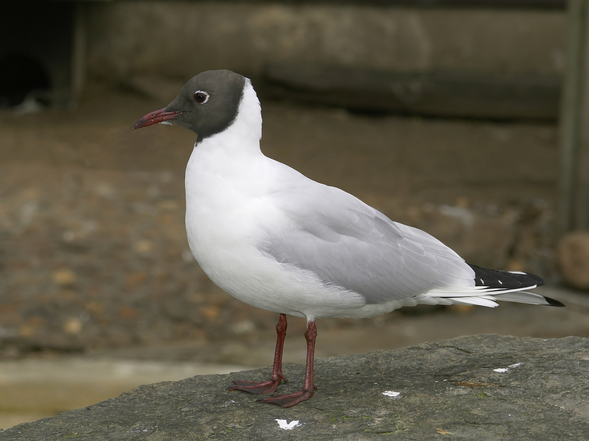

# Stage structured models {#s04-Stage}


The life table and associated parameters defined in the previous chapters apply only to age structured populations. However, the methods you learned for matrix models can be used with any projection matrix $\mathbf{A}$ (provided it fulfills certain mathematical assumptions). The only difference is that the results refer to stages instead of age class. This chapter will present a general stage structured matrix model and show how to build the projection matrix from four main components describing transitions, survival probability and fertility. We will then go through some main sources of stage structure and consider examples. 

<br>

## Learning goals 

* Understand the key components of a stage structured matrix model.

* Get the vectors of survival probability and fertility coefficients from  the matrices $\mathbf{U}$ and $\mathbf{F}$ .

* Discuss some main sources of stage structure.

* Draw a life cycle graph for any stage structured model.

* Apply methods from chapter \@ref(s03-MatrixModels) to stage structured matrix models

* Define a simple integral projection model for size structured populations.


<br>

## General stage structured matrix model

We will now extend the age structured model to the general case of stage structured models, which can be adapted to describe many different kinds of stage structure. As shown by @Vindenes2020, the general projection matrix $\mathbf{A}$ can be decomposed into four main components:

\begin{align}
\mathbf{A}&=\mathbf{U}+\mathbf{F}=\mathbf{G}\text{Diag}(\mathbf{s})+\mathbf{Q}\text{Diag}(\mathbf{f}),
(\#eq:General)
\end{align}

where $\mathbf{G}$ is a transition matrix containing the transition probabilities $g_{ij}$ from stage $j$ to stage $i$ per time step (column sums of this matrix should all be 1),  $\mathbf{s}$ is the vector of survival probabilities (survival from current to next time step) in each stage,  $\mathbf{Q}$ is a matrix containing the probabilities $q_{ij}$ that an offspring produced in stage $j$ is assigned to stage $i$ at birth (columns should sum to 1), and $\mathbf{f}$ is the vector of fertilities per stage, i.e. the mean number of offspring contributed by an individual to next time step's population.

For a population with 3 stages, the elements of each matrix in  equation \@ref(eq:General) are given by

\begin{align*}
&\left[\begin{matrix} 
g_{11}s_1+q_{11}f_1  & g_{12}s_2+q_{12}f_2 & g_{13}s_3+q_{13}f_3\\ 
g_{21}s_1+q_{21}f_1  & g_{22}s_2+q_{22}f_2 & g_{23}s_3+q_{23}f_3\\ 
g_{31}s_1+q_{31}f_1  & g_{32}s_2+q_{32}f_2 & g_{33}s_3+q_{33}f_3 
\end{matrix}\right]\\
=
&\left[\begin{matrix} 
g_{11} & g_{12}& g_{13} \\ 
g_{21} & g_{22}& g_{33} \\ 
g_{31} & g_{32}& g_{33}  
\end{matrix}\right]
\left[\begin{matrix} 
s_1 & 0& 0 \\ 
0 & s_2&0 \\ 
0 & 0& s_3 
\end{matrix}\right]+
\left[\begin{matrix} 
q_{11} & q_{12}& q_{13} \\ 
q_{21} & q_{22}& q_{33} \\ 
q_{31} & q_{32}& q_{33}  
\end{matrix}\right]
\left[\begin{matrix} 
f_1 & 0& 0 \\ 
0 & f_2&0 \\ 
0 & 0& f_3 
\end{matrix}\right].
\end{align*}

 
<br>

The stage-specific survival and fertility coefficients are the same as before: The survival coefficient $s_j$ represent the  probability that an individual in stage $j$ will survive until the next time step. The fertility coefficient $f_j$ represent the average number of offspring contributed by an individual in stage $j$ to the population in the next time step. Census time still plays a role in the definition of the fertility coefficient  from underlying parameters. 

The main difference from age structured models is the explicit specification of the transition matrices $\mathbf{G}$ and $\mathbf{Q}$. The matrix $\mathbf{G}$ specifies the transition probabilities between stages in the model, while $\mathbf{Q}$ specifies the probabilities for assigning offspring among the stages. 

Note that for the methods defined in chapter \@ref(s03-MatrixModels) to work, the transition matrices together need to be defined in such a way that all stages are 'connected'. For any given stage, it must be possible for an individual or its descendents to reach any other stage in the model within some (non-infinite) number of time steps. Otherwise, the model could lead to disconnected sub-populations and the methods for calculating $\lambda$, stable structure etc would no longer work. We will not define the mathematical criteria for these requirements here (see e.g. @Caswell1 for details), but note that with stage-structured models we have to be more careful with specifying the stages and transition probabilities. For most biologically realistic and well defined models this is not a problem.

With this general definition of the projection matrix we can obtain special cases by adjusting the transition matrices $\mathbf{G}$ and $\mathbf{Q}$. For instance, for an age structured model with 3 stages these matrices are given by
\begin{align*}
\mathbf{G}=
\left[\begin{matrix} 
0 & 0& 0 \\ 
1 & 0& 0 \\ 
0& 1& 1 
\end{matrix}\right],
\end{align*}
and 

\begin{align*}
\mathbf{Q}=
\left[\begin{matrix} 
1 & 1& 1 \\ 
0 & 0& 0 \\ 
0& 0& 0 
\end{matrix}\right].
\end{align*}

Note that the transition matrix $\mathbf{G}$ has the value 1 in the lower right corner, meaning that if the survival probability is not zero in the final age class individuals will be allowed to accumulate in this class. For a 'true' age-structured model the survival probability should be zero in the final class.  Since all offspring are born into the first age class, the matrix $\mathbf{Q}$ contains 1's on all elements of the first row (even if the fertility coefficient may be 0) and 0 elsewhere. 

<br>

## Decomposing $\mathbf{U}$ and $\mathbf{F}$ 

It is often useful to decompose the matrices $\mathbf{U}$ and $\mathbf{F}$ based on equation \@ref(eq:General) to obtain the transition matrices $\mathbf{G}$ and $\mathbf{Q}$ and the vectors of survival probability $\mathbf{s}$ and fertility $\mathbf{f}$. 

Note that in general we need to do this decompososition from $\mathbf{U}$ and $\mathbf{F}$, as it is not possible to decompose elements of $\mathbf{A}$ directly (without being given more information on the life history).

To decompose  $\mathbf{U}$ and $\mathbf{F}$ we take advantage of the fact that the column sums of the transition matrices have to sum up to one (individuals have to end up in one of the stages, if they survive). This means that the column sums of $\mathbf{U}$ are the stage-specific survival coefficients, while the column sums of $\mathbf{F}$ are the stage-specific fertilities.

The following R function returns the survival vector $\mathbf{s}$ and the transition matrix $\mathbf{Q}$ based on the matrix $\mathbf{U}$:

```{r}
DecomposeU <- function(MatU){
  k<-dim(MatU)[1]
  if(is.na(MatU[k,k])){
    MatU[k,k]<-0
  }
  Svec <- apply(MatU,2,sum)
  MatG <- t(t(MatU)/Svec)
  for(i in 1:k){
    if(Svec[i]==0){
      MatG[,i] <- 0
      MatG[i,i] <- 1
    }
  }
 list("Gmat"=MatG,"Survival"=Svec)
}
```

<br>

Similarly, this following R function returns the survival vector $\mathbf{s}$ and the transition matrix $\mathbf{Q}$ based on the matrix $\mathbf{U}$

<br>

```{r}
DecomposeF <- function(MatF){
	k <- dim(MatF)[1]
	Fvec <- apply(MatF,2,sum)
	MatQ <- matrix(0,k,k)
	for(i in 1:k){
		if(Fvec[i]==0){
			MatQ[1,i]<-1
			
		}
		else{
			MatQ[,i]<-MatF[,i]/Fvec[i]
		}
	}
 list("Qmat"=MatQ,"Fertility"=Fvec)
}
```


<br>


## Examples of stage structured models  

This section includes some descriptions and examples for a few common types of stage structured models.  This is by no means a comprehensive list of all possible kinds of stage structure - which is almost endless. 

<br>

### Lefkovitch models

@Lefkovitch1 introduced an important extension of age structured models for life histories of discrete stages where individuals can either remain in the same stage or transition to the next stage with a certain probability. 
Distinct life cycle stages are typical for many invertebrates, and the Lefkovitch model can also be used for discrete stages representing size, where individuals can either grow (to the next size stage) or not. 


With this kind of structure, there will be two transition probabilities for each stage. For instance, if the the probability of developing from stage $j$ to $j+1$ is denoted $g_j$, then the probability of remaining is $(1-g_j)$. Offspring transitions are usually the same as in age structured models, i.e. the first stage is the offspring stage and the matrix $\mathbf{Q}$ will have 1's on the first row and 0's elsewhere.  The projection matrix of such a model with 3 stages takes the form


<br>


\begin{align}
\mathbf{A}=&\left[\begin{matrix} 
(1-g_{1}) s_1+ f_1  &  f_2 &   f_3\\ 
g_{1}s_1   & (1-g_{2})s_2  & 0 \\ 
0   & g_{2}s_2  &  s_3 \\ 
\end{matrix}\right].
(\#eq:Lefkovitch)
\end{align}

This kind of projection matrix is also known as a **Lefkovitch matrix**. Here,  surviving individuals accumulate in the final stage. Note also that the first element $A_{11}$ of the transition matrix potentially depends on both survival and reproduction. Although in most life histories individuals do not reproduce during their first year, this can happen in some cases. For these models we need to be careful when decomposing the projection matrix so that fertility coefficients are not inadvertently interpreted as survival, and vice versa.
 

<br>

#### Example: Wild boar {-}  

 

 <center>

```{r fig6, fig.cap='Wild boar (*Sus scrofa*). Photo: Dave Pape', echo=FALSE, message=FALSE, warning=FALSE, out.width = '60%'}
knitr::include_graphics('Villsvin.jpg')
```

</center>

<br>

As an example of a study using a Lefkovitch matrix, we can consider the model of @Bieber1 for female wild boar. Their model has annual time steps and three stages: Juveniles (age 0-1), yearlings (age 1-2) and adults (age 2+). Thus, the first to stages represent age classes lasting 1 year each, while the final stage contain all individuals of age 2 and above. Wild boar start reproducing before their first year, so in this case even the juveniles can contribute offspring to the next year's population (figure \@ref(fig:wildboar)).

<center>

```{r wildboar, fig.cap='Life cycle graph for the wild boar (*Sus scrofa*), fig 1 from @Bieber1.',  out.width = '60%', echo=F}
knitr::include_graphics('LifeCycleBoar.jpg')
```

</center>

 
The projection matrix for this wild boar model is given by 
 
$$
\mathbf{A}=\left[\begin{matrix} 0.26 & 0.94 &1.93  \\ 0.33&0  &0  \\ 0&0.4  &0.66  \\  \end{matrix}\right].
$$

<br>

This matrix is quite similar to an age structured model (Leslie matrix), but with the exception that adults do not necessarily die after reaching age 2, but can continue to live so that the final stage contains all individuals of age 2 and more (2+). 
 
 
 

<br>
 

### Age by stage models {#agestage}

Individuals in a population will always differ in more than one way, and sometimes (depending on the study question as well as the species) we have to account for more than one state variable in order to adequately describe the life history.  For instance, we may need to combine age and life cycle stage, if the age differences within each stage are large. Even if age does not have a large effect on survival and fecundity compared to stage, we often need to describe how model outputs (e.g. sensitivities) change with age, for instance to compare with other age-structured models. Models that combine age and stage are able to handle a wide range of possible structures - and can be seen as a special case of the general stage structured model where each class is a combination of age and stage.

For instance, there are $k$ age classes, and $m$ stages, the new age by stage model will have $\phi=k*m$ classes in total.  From these classes we can define a new projection matrix of dimension $\phi \times \phi$, which can be analysed using the same methods as before to find $\lambda$ and other parameters. For a broad overview of this kind of matrix model, see @Caswell19.

<br>

#### Example: Black-headed gulls {-} 

<center>

```{r BlackHeadedGull, fig.cap='Black-headed gull (*Chroicocephalus ridibundus*). Photo: Hans Hillewaert (https://creativecommons.org/licenses/by-sa/4.0/)', echo=FALSE, message=FALSE, warning=FALSE, out.width = '60%'}

```

</center>

<br>

@Lebreton2 used an age-by-stage model to study a french colony of black-headed gulls (*Chroicocephalus ridibundus*) living in two types of habitat of 'good' and 'poor' quality. In this species dispersal among habitats happens mainly before first reproduction, but young breeders may also disperse. @Lebreton2 considered different scenarios for dispersal, here we will consider the scenario where only offspring disperse. This model was also used as an example by @Hunter2 demonstrating a useful approach ('vec-permutation') to calculate sensitivity in age-by-stage models, and by @Vindenes2020 in their introduction to matrix models.

The gulls have five main age classes corresponding to age 1, 2, 3, 4, and 5+ (all individuals of age 5 and older). With two habitats and five age classes we get a $10\times 10$ projection matrix, where each stage corresponds to a combination of habitat and age class. There are two ways to structure such a matrix [@Lebreton2]: Either include age within habitat (so that the first five stages represent habitat 1 and the last five habitat 2), or habit within age class (the first two stages represent habitat 1 and 2 in age class 1, etc).   

Using a structure of age within habitat, we get the following projection matrix [@Vindenes2020]:

\begin{align}\label{AGulls}
\mathbf{A}
&=\left[\begin{array}{ccccc|ccccc}
f_1&f_2&f_3&f_4&f_5 &0&0&0&0&0 \\
(1-p)s_1&0&0&0&0&qs_6&0&0&0&0\\
0&s_2&0&0&0&0&0&0&0&0\\
0&0&s_3&0&0&0&0&0&0&0\\
0&0&0&s_4&s_5&0&0&0&0&0\\
\hline
0&0&0&0&0&f_6&f_7&f_8&f_9&f_{10}\\
ps_1&0&0&0&0&(1-q)s_6&0&0&0&0\\
0&0&0&0&0&0&s_7&0&0&0\\
0&0&0&0&0&0&0&s_8&0&0\\
0&0&0&0&0&0&0&0&s_9&s_{10}\\
\end{array}\right].
\end{align}

<br>

The constants $p$ and $q$ describe dispersal probabilities of 1-year olds: The probability of dispersing from a good to a poor quality habitat is $p$, while $q$ is the probability of dispersing from the poor to the good habitat. This is also an example of source-sink dynamics, where the good habitat (the source) is sustaining the population living in the poor habitat (a sink). There is a limited number available number of breeding spots in good habitats, so some individuals are forced to use a lower quality site.

The survival coefficients are given by $\mathbf{s}=[0.8, 0.82, 0.82, 0.82, 0.82]$ for both sites, while the fertility coefficients differ. In the good site they are given by $\mathbf{f}_\text{good}=[0, 0.096, 0.16, 0.224, 0.32]$, and in the poor site by $\mathbf{f}_{\text{poor}}=[0, 0.1, 0.16, 0.2, 0.2]$. Thus, for the youngest breeders the fertility is slightly higher in the poor site, but for older breeders the fertility is higher in the good site.

In R we can construct the projection matrix as a function of the dispersal rates $p$ and $q$ as follows:


```{r }
Sboth <- c(.8, rep(.82,4))
Fgood <- c(0, 0.096, 0.16, 0.224, 0.32) 
Fpoor <- c(0, 0.1, 0.16, 0.2, 0.2) 

AmatGulls <- function(p, q){
  #Survival in good environment:
  SGood <- c((1-p)*Sboth[1], Sboth[2:5])
  #Survival in poor environment:
  SPoor <- c((1-q)*Sboth[1], Sboth[2:5])
  Amat <- matrix(0, 10, 10) 
  #-----------------------------------------------
  # Fertility in good site:
  Amat[1, 1:5] <- Fgood 
  # Fertility in poor site:
  Amat[6, 6:10] <- Fpoor 
  #-----------------------------------------------
  #P(survive and remain), good site
  diag(Amat[2:5,1:4]) <- SGood[1:4] 
  #P(survive), last class
  Amat[5,5] <- SGood[5]  
  #P(survive and remain), poor site
  diag(Amat[7:10,6:9]) <- SPoor[1:4]  
  #P(survive), last class
  Amat[10,10] <- SPoor[5]  
  #-----------------------------------------------
  #Survive / disperse from good to poor:
  Amat[7,1] <- p*Sboth[1] 
  #Survive / disperse from poor to good
  Amat[2,6] <- q*Sboth[1] 
  #-----------------------------------------------
  Amat
}
```

<br>

With this function we can make calculate $\lambda$ for different combinations of the two dispersal probabilities and plot the result. Here we also use the `expand_grid` function, which is useful for making new data frames for combinations of variables:

 
 
```{r gullfig,  fig.width=4,fig.height=4,fig.cap="Surface of $\\lambda$ as a function of dispersal parameters $p$ (probability of leaving the 'good' site) and $q$ (probability of leaving the 'poor' site) in the black-headed gull model."  }

#Sequences of p and values
pVec <-  seq(0,1,.01)
qVec <-  seq(0,1,.01)

gulls_table <- expand_grid("p"=pVec, "q"=qVec )

lambdagulls <- function(p, q){
  uvlambda(AmatGulls(p=p,q=q))$lam
}

gulls_table <- gulls_table %>% rowwise() %>% 
  mutate(lambda=lambdagulls(p,q))  

ggplot(gulls_table, aes(x=p, y=q, fill=lambda) ) + 
  geom_tile()+
  scale_fill_viridis_c()  +
  theme_classic()+
  labs(fill=expression(lambda))+
  theme(legend.position = "top" )  
   
```
 


<br>


### Disease models

Stage structured matrix model play an important role in understanding disease dynamics, for systems that can be analysed with discrete time models. Classifying host individuals according to disease status (susceptible, infected, etc) is essential, and often other sources of variation need to be accounted for as well (age, sex, and other factors that can affect disease transmission and immunity). Space is another fundamental factor that often needs to be included to accurately capture the dynamics of an epidemic. In host-vector-pathogen systems the vector can also be classified according to multiple stages.

Disease dynamics are inherently frequency-dependent, so cannot be analyzed with the density independent methods presented so far, but they often have equilibrium dynamics that are analysed with matrix model methods. The parameter $R_0$ (that we now know as the lifetime reproductive success) has an important interpretation in disease models as the total number of new infections that each infected individual will give rise to in a susceptible population. In other words it is the lifetime reproductive success of the pathogen.

One of the simplest and most common models for disease dynamics is the SIR model [@Kermack1], classifying host individuals into three disease states  (Susceptible - Infected - Recovered). This is an example of a compartmental model in epidemiology.  
 
<br>

## Integral projection models (IPMs)
Many state variables are intrinsically continuous, such as body size. Matrix models can still be used to study size structure by lumping individuals into different discrete size classes, but this adds an extra modeling decision of where to set the limits for each size class. And sometimes this decision affects the results of the model.  This can be avoided by using an IPM, i.e. an **integral projection model**  [@Easterling1], which accomodates continuous state variables.  Instead of a population vector with a discrete number of stages, IPMs track individuals over a continuous trait distribution $n(z)$, where $z$ represents the trait measure (e.g. size), and instead of a projection matrix, IPMs use a projection kernel. You can think of an IPM as a matrix model with infinitely many stages, and in fact they belong to the same class of models (matrix models). The good news is that IPMs can be analysed with matrix model methods (e.g. those introduced in chapter \@ref(s03-MatrixModels)) to find $\lambda$ and other model outputs. In R, we then specify the mesh size of the kernel (creating a matrix), and the finer the mesh size the more accurate are the estimated model outputs.

IPMs and matrix models are both part of the same model framework (matrix models).  The main difference between an IPM and a matrix model is in how the underlying parameters  are (typically) estimated from data: With IPMs we typically use some kind of regression model, where the state variable is an explanatory variable explaining the survival, fecundity and transition rates that define the model. With matrix models, these parameters are usually estimated independently within each stage, without treating the stage as an explanatory variable - however regression models can still be used to estimate parameters of a matrix model.  We will not go into details regarding IPMs here, but you have already learned the methods for analyzing them, as they are the same as for matrix models. For more details on IPMs and their application, see @Ellner5.

<br>


## Exercises  


For suggested solutions, see appendix \@ref(s09-Solutions).

 
<br>

### Exercise 4.1  {-} 

1. Draw the life cycle graph for each of the projection matrices below. 


 $$\mathbf{A}=\left[\begin{matrix}0.5&2\\1&0.7\end{matrix}\right]$$

 $$\mathbf{A}=\left[\begin{matrix}0&0&10\\0.9&0&0\\0&0.9&0\end{matrix}\right]$$

 $$\mathbf{A}=\left[\begin{matrix}0&8&5\\0.9&0.1&0.7\\0&0.7&0.2\end{matrix}\right]$$


2. Can you determine the stage-specific survival probability in each case? What assumption(s) do you need to make in order to do this?

3. What could the stages represent in each case? 

<br>

### Exercise 4.2 {-}

This exercise is based on an experimental toxicology study by @Kammenga1, and their model for the isopod common woodlouse (*Porcellio scaber*) was also used as an example by @Vindenes2020. The woodlouse model has seven discrete life history stages and monthly time steps. 


<center>

```{r Porcellio1, fig.cap='Common woodlouse (*Porcellio scaber*).',  out.width = '40%', echo=F}
knitr::include_graphics('Porcellio_scaber.jpg')
```

</center>

There are 7 main stages in this woodlouse model:


1. Oocytes                                    
2. Eggs/offspring (in marsupium)                              
3. Juveniles                                  
4. First (spring) reproductive stage                                     
5. Non-reproductive adult stage                                       
6. Second (summer) reproductive stage                              
7. Senescent non-reproductive stage


<br>

The following life cycle graph is from @Kammenga1 (their fig. 1B):

 <center>

```{r Porcellio2, fig.cap='Life cycle graph for the common woodlouse (*Porcellio scaber*).',  out.width = '80%', echo=F}

```


</center>

<br>

 
The vectors of P, G and F in R have the following values: 

```{r, echo=F}
x <- 1:7 
m <- 12 #Average oocyte number per female per month
Pvec<- c(0.1584,
         0.5451,
         0.539,
         0.1615,
         0.008, 
         0.136, 
         0.8)
Gvec <- c(0.7216,
          0.2449,
          0.231,
          0.7885,
          0.792, 
          0.664,
          0)
Fvec <- c(0,
          0,
          0, 
          Gvec[3]*m*.5 +Pvec[4]*m*.5 , 
          0,
          Gvec[3]*m*.5 +Pvec[4]*m*.5,
          0)

Umat.isopod <- Fmat.isopod <- matrix(0,7,7)
Umat.isopod[row(Umat.isopod) == col(Umat.isopod) + 1] <- Gvec[1:6]
Umat.isopod[row(Umat.isopod) == col(Umat.isopod)] <- Pvec

Fmat.isopod[1,] <- Fvec


Fvec <- c(0, 0, 0, Umat.isopod[4,3]*m*.5 +Umat.isopod[4,4]*m*.5 , 0, Umat.isopod[6,5]*m*.5 +Umat.isopod[6,6]*m*.5,0)
 
LifeTableIsopod <- tibble(x, Pvec, Gvec, Fvec)
 
knitr::kable(LifeTableIsopod, digits=3 , align='c', col.names=c("Stage", "P", "G", "F"))
```

<br>

1. Use the life cycle graph and the vectors defined in the table to define the fertility matrix $\mathbf{F}$, the survival matrix $\mathbf{U}$, and the projection matrix $\mathbf{A}$ in R.  

2. Decompose the matrices $\mathbf{U}$ and $\mathbf{F}$ to calculate the stage-specific fertility and survival probability, and the transition matrix (based on the decomposition in equation \@ref(eq:General). Plot the stage-specific fertility and survival probability.

3. Calculate $\lambda$, the stable stage structure  $\mathbf{u}$  and reproductive values $\mathbf{v}$, and plot $\mathbf{u}$ and $\mathbf{v}$. How fast does this population grow per year? Does this model work well to describe a life history that reproduces twice per year [@Kammenga1]?

4.   Write an R function that returns the value of $\lambda$ for this population for a set of three vectors corresponding to *proportional changes* to elements of $P$, $G$ or $F$. What happens to $\lambda$, $\mathbf{u}$ and $\mathbf{v}$ if you modify the element $G_6$ in the vector $G$? Explain why.

5.  What happens to $\lambda$, $\mathbf{u}$ and $\mathbf{v}$ if you modify the element $G_4$? Explain why.

 
 
<br>


### Exercise 4.3 {-}

This exercise will continue with the woodlouse model from the previous exercise.

@Kammenga1 considered toxicological effects of cadmium. At the highest concentration, the woodlouse will switch to only one reproductive event  instead of two, and the survival probabilities are reduced between 7 and 12 % in all stages except the egg stage. In addition the development time of eggs decreased [@Kammenga1]. For this exercise we assume the values of $P$, $G$, and $F$ corresponding to cadmium exposure are given by


<br>

```{r, echo=F }
PvecC <- Pvec*c(1,rep(0.9,6))
GvecC <- Gvec*c(1,rep(0.9,6))
FvecC <- c(0, 0, 0,Fvec[4], 0,0,0)
 
LifeTableIsopod2 <- tibble(x, PvecC, GvecC, FvecC)
 
knitr::kable(LifeTableIsopod2, digits=3 , align='c', col.names=c("Stage", "P", "G", "F"))
```

<br>


 1. Define a new matrix $\mathbf{A}_C$ (C for cadmium) in R based on these values. This is now a treatment matrix, while the previously defined matrix is the reference matrix. 

2. Calculate $\lambda$ for the new matrix. How does it compare to the previous value?

3. Calculate the halfway matrix $\mathbf{A}^*$ and the difference matrix $\mathbf{D}$. 

4. Calculate the sensitivity matrix $\mathbf{S}^*$ based on the halfway matrix, and finally calculate and plot the elements of the matrix corresponding to the contributions to the difference in $\lambda$ between $\mathbf{A}$ and $\mathbf{A}_C$. Which element contributes the most?

5. Why is it often better to use an LTRE than a sensitivity analysis when we want to understand the impacts of an external factor such as a toxicant?
