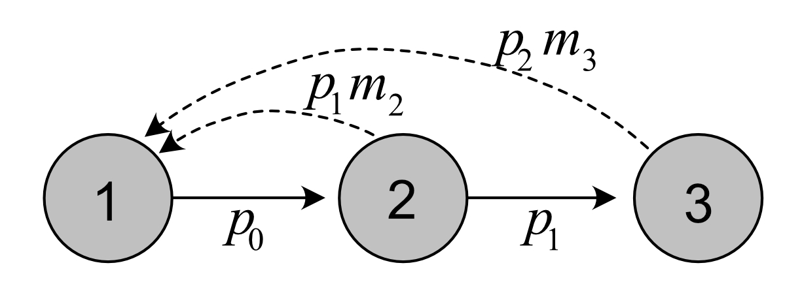
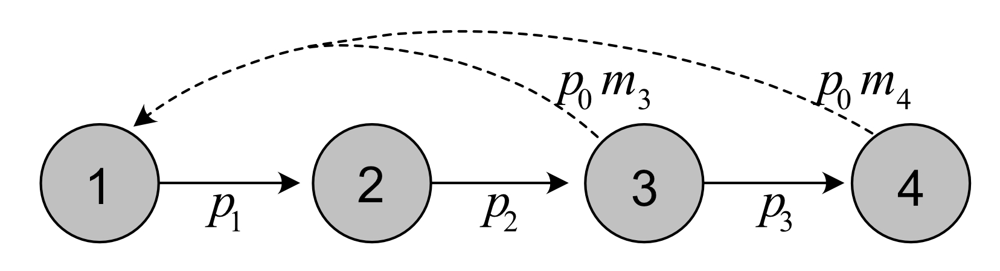
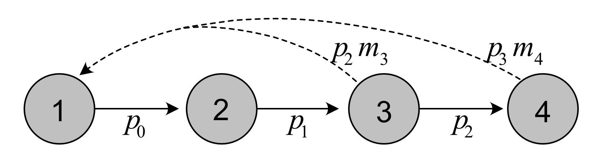
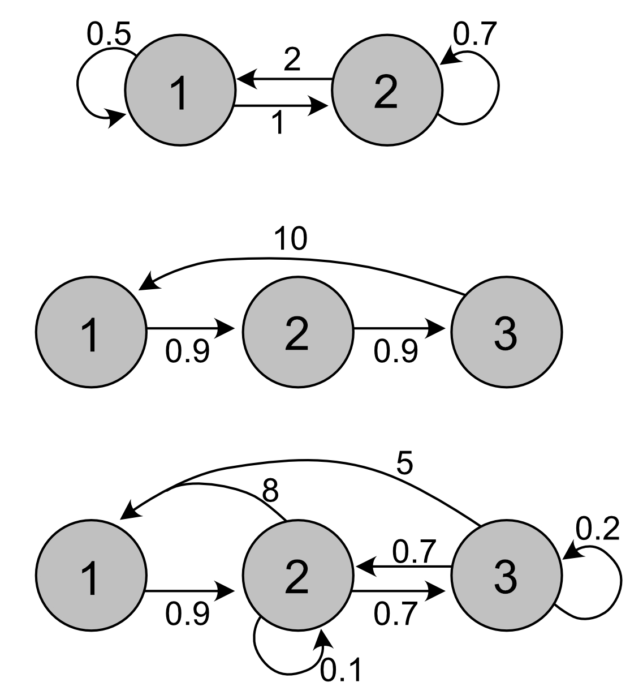

# (APPENDIX) Appendix {-} 
 
# Suggested solutions to exercises  {#s09-Solutions} 

<br>

## Chapter 1 exercises  

### Exercise 1.1 {-}

1. Make R function for exponential growth:

```{r}
#lambda: Multiplicative growth rate
#N0: Initial population size
#Tmax: Number of time steps

Exp.growth <- function(lambda, N0, Tmax){
        N0*lambda^(0:Tmax)
}

#test:
Exp.growth(lambda=1.3, N0=10, Tmax=5)        
```


<br>


2. Plot population growth for different values of $\lambda$:

<br>
 
```{r, fig.width=6, fig.height=4}
#Make a vector of lambda values:
lambdavec <- seq(.5, 1.5, by=.1)

#Store growth results for each lambda value in a data frame:
results <- expand.grid(lambda=lambdavec, Time=0:10)
for(i in 1:length(lambdavec)){
        results$Popsize[results$lambda==lambdavec[i]] <-
          Exp.growth(lambda=lambdavec[i], 
               N0=10,
               Tmax=10)
}

#Store log population size (better for plotting)
results$LogSize <- log(results$Popsize)

#Plot with ggplot:
ggplot(results) + 
    geom_line(aes(x=Time, y=LogSize, col=lambda, 
                  group=lambda ), lwd=1.2) +
    theme_bw() +
    scale_color_viridis_c()+
    theme(legend.position = "top" )+ 
    labs( x="Time", y=expression(ln(N)),
          color=expression(lambda))+ 
    guides(color = guide_legend(nrow = 1, 
                                byrow = TRUE))
``` 

 
 <br> <br>
 
 
 
### Exercise 1.2 {-}

 <br>
 
1. 

Value of $\lambda$: If the population grows by 1$\%$ per day, that means $\lambda\approx 1.01$, with a unit of days.

 <br>
 
2. 

Doubling time: We denote the doubling time as $t_2$. Inserting $N=2N_0$ in the equation of exponential growth, we get:

\begin{align*}
2N_0&=N_0\lambda^{t_2}\\ 
\lambda^{t_2}&=2 \\ t_2\ln\lambda&=2\\ 
t_2&=\frac{2}{\ln\lambda} =\frac{2}{\ln 1.01} \approx 201.  
\end{align*}

The population will take approximately 201 days to double in size.

 <br>
 
3. 

Population size after 1 year: One year is approximately 365 days, so with a starting populatoin of 100 individuals we get

$$N=100\cdot 1.01^{365}\approx 3778.$$
 <br>
 
Plot population growth over a year:

 <br>

```{r, fig.width=6, fig.height=4}
sgrowth <- Exp.growth(lambda=1.01, N0=100, Tmax=365)

#Store as data frame for plotting:
silverfish <- data.frame(sgrowth, Time=0:365)

#Plot with ggplot:
ggplot(silverfish) + 
    geom_line(aes(x=Time, y=sgrowth), lwd=1.2) +
    theme_bw() +
    labs( x="Time", y="Silverfish population")
``` 

 
<br><br>
 
## Chapter 2 exercises  

 <br>

### Exercise 2.1 {-}

1. 

The number of children includes boys and girls, so to get $R_0$ we divide by half (assuming equal sex ratio at birth). Using the approximation ($\lambda\approx \exp\left(\frac{\ln R_0}{T_C}\right)$), we can add values of $\lambda$ to the table (here assuming a generatio ntime of $T_C=25$ or $T_C=30$): 

<br>


```{r table21_sol, echo=F }
Country <- c("Mali", "Tunisia", "Australia", "Norway", "South Korea")
Children <- c(5.8, 2.2, 1.7, 1.6, 0.9) 
R0 <- Children/2
lambda25 <- exp({log(R0)/25})
lambda30 <- exp({log(R0)/30})
  
Table21_sol <- tibble(Country, Children, R0, lambda25, lambda30)
 
colnames(Table21_sol) <- c("Country", "Children per woman", "$R_0$", "$\\lambda_{25}$","$\\lambda_{30}$") 

knitr::kable(Table21_sol, digits=3 , booktabs = TRUE,  align="c", escape=FALSE)
```

<br>

As generation time $T_C$ increases, $\lambda$ increases if the population is declining ($\lambda<1$), but declines if the population is growing (note: this exercise ignores immigration and emigration so the value of $\lambda$ does not represent the real population trends in these countries.)

<br>

2. 

To answer this question we use the values $\lambda_{25}$, and apply the formula from exercise 1.2 to find the doubling time ($t_{2}=2/\ln \lambda_{25}$):


 
<br>


```{r table21_sol2, echo=F }
Country <- c("Mali", "Tunisia", "Australia", "Norway", "South Korea")
Children <- c(5.8, 2.2, 1.7, 1.6, 0.9) 
R0 <- Children/2
lambda25 <- exp({log(R0)/25})
doubling <- 2/log(lambda25)
  
Table21_sol2 <- tibble(Country, Children, R0, lambda25, doubling)
 
colnames(Table21_sol2) <- c("Country", "Children per woman", "$R_0$", "$\\lambda_{25}$", "Doubling time") 

knitr::kable(Table21_sol2, digits=3 , booktabs = TRUE,  align="c", escape=FALSE)
```

<br>

Declining populations ($\lambda<1$) get negative doubling rates. Naturally these populations cannot double in size with negative growth. The growing populations ($\lambda>1$) have a doubling time of 47 years (Mali) and 525 years (Tunisia). 

<br>

3. 

The exponential growth model is too simple to describe long-term growth of human population sizes. It describes current trends of growth given the current rates of survival and fertility. Both survival and fertility change over time, and the annual population growth rate is not constant, but has declined over time in most countries. The generation time also varies much among populations and will change over time (as it is a function of the survival and fertility rates). In particular for countries that currently grow fast we should be careful with making long-term extrapolations based on the exponential growth model. Finally, this exercise ignores immigration and emigration, which can be a large factor affecting population growth.
 
 <br>
 
 
 
### Exercise 2.2 {-}

1. 

The age at first reproduction is 3 years. This is the first age where $m_x>0$ in the life table.

<br>

2. 

Creating the life table in R (here we use the function ´data.frame()´, other options can also be used, like `tibble()` from tidyverse):


```{r  }
x <- 0:4 
nx <- c(12376, 4233, 1790, 340, 268)
mx <- c(0, 0, 0, 2.1, 3.2)
 
PlantTable <- data.frame(x, nx, mx) 
```

 
 <br>
 
3. 

Adding vectors of cumulative survival probability $l_x$  and annual survival probability $p_x$ to the life table:
 
 
```{r }
lx <- nx/nx[1] #divide all elements of nx by the first.
px <- c(lx[2:5]/lx[1:4],0) #by definition the last value is zero.

PlantTable$lx <- lx
PlantTable$px <- px

PlantTable
```
<br>
 
4. 

Plots of each life table column ($n_x$, $l_x$, $p_x$, $m_x$) as a function of age $x$:

<br>

```{r, fig.height=6,fig.width=9}
#Convert to long table format for plotting:
plant.long <- PlantTable %>% 
  pivot_longer(c(nx, lx, px,  mx),
               names_to = "VitalRates", 
               values_to = "Value")
 
ggplot(plant.long) + 
  geom_col(aes(x=x, y=Value, 
               fill=VitalRates), lwd=1.2)+
  scale_fill_manual(values=colors4)+
  theme_bw()+
  facet_wrap(~factor(VitalRates,
                     levels=c("nx", "lx" , "px", "mx")), 
             scales="free")+
  theme_bw() +
  labs( x="Age (year)", y="Value")+
  theme(legend.position = "none" ) 
  
```


<br>

The shape of $l_x$ follows the decline in cohort size over age, as it should. The annual survival probability fluctuates between ages but is quite low in the first years until the plant starts to reproduce at age 3. From age 3 to 4 the survival probability is much higher, almost 0.8, but then no plants survive after age 4 (last reproduction).  Since all remaining plants die in the final year, the plants likely invest all resources in reproduction this year, and fecundity is higher at the second reproduction.  

<br>


5. 

Mean lifetime reproduction $R_0$ from the life table:  

<br>

```{r }
R0_Plant <- sum(PlantTable$lx*PlantTable$mx)

round(R0_Plant, digits=3)
```


The value of $R_0$ is very low. Each plant is replaced by only 0.13 new plants on average. This means that $\lambda<1$.


<br>

6. 

Generation time $T_C$ from the life table: 

 

```{r }
TC_Plant <- sum(PlantTable$x*PlantTable$lx*PlantTable$mx)/R0_Plant

round(TC_Plant, digits=3)
```


<br>

This is the cohort generation time, and shows the average age at which the $R_0$ offspring are produced.  

Approximation of $\lambda$ based on $R_0$ and $T_C$: 


```{r}
lambda_Plant <- exp(log(R0_Plant)/TC_Plant)
#round(lambda_Plant, digits=3)
```

Thus, the population growth rate is very low at $\lambda\approx$ `r round(lambda_Plant, digits=3)`. Almost half the population is lost each year.

<br>

7. 

Solving the Euler-Lotka equation for $\lambda$:

```{r}
#Rearranging the Euler-Lotka function 
#to get an expression equal to zero:
EulerLotka <- function(lambda, x, lx, mx){
  sum(lambda^(-x)*lx*mx)-1
}

#Define search range for lambda in uniroot
lambda.range <- c(.1,2)

#Apply uniroot to find lambda, store the result
lambda_Plant2 <- uniroot(EulerLotka, 
                         x=PlantTable$x, 
                         lx=PlantTable$lx, 
                         mx=PlantTable$mx,
                         interval=lambda.range)$root

#round(lambda_Plant2, digits=3)
```

The value calculated from the Euler-Lotka equation is $\lambda\approx$ `r round(lambda_Plant2, digits=3)`, a bit higher than the approximated value.

<br>

### Exercise 2.3  {-} 

1. 

According to table \@ref(tab:tablebird), the fecundity values of age 2 and 3 are $m_2=3$ and $m_3=6$. To get the clutch size these values should be multiplied by 2 (assuming equal sex ratio), and divided by the survival probability. This gives an average clutch size of $M_2=3\cdot2/0.9=6.67$ eggs at age 3, and $M_2=6\cdot2/0.9=13.33$ eggs at age 4.

Thus, older parents produce larger clutches than younger ones, in this (fictive) example.

<br>

2. 

Under the assumptions of the Lack clutch, the trade-off is defined as $c=\frac{1}{2N_e^*}$. At age 2, the Lack clutch size is 6.67 and we thus get $c=\frac{1}{2\cdot6.67}\approx 0.074$. At age 3 the Lack clutch size is 13.33 and the trade-off is  $c=\frac{1}{2\cdot13.33}\approx 0.038$. Remember that the stronger the trade-off, the lower the clutch size. If the clutch size at each age is determined by this trade-off only (as the Lack clutch assumes), this means that the trade-off is reduced with age for this example. In reality, physical and behavioral constraints also limit clutch size of young versus older birds, in particular in first-time breeders versus experienced breeders.


 <br>

3. 

To solve this we use the Euler-Lotka-equation, and insert the information we have (the value of $\lambda=1.07$ is calculated in the example for the Euler-Lotka equation):

\begin{align*}
\sum_x \lambda^{-x}l_xm_x&=1\\
\lambda^{-3}l_3m_3&=1\\
1.07^{-3}0.108m_3&=1\\
m_3&=1.07^{3}/0.108 \approx 11.34.
\end{align*}

Thus, the fecundity of the related species is higher, which makes sense since it only reproduces at age 3 while still having the same fitness as the example bird.

<br>


4. 

In Cole's paradox, the semelparous species only needs one more offspring per clutch to get the same fitness as the iteroparous species. The result of the previous question tells us that the semelparous bird needs a much larger clutch size to match the fitness of the iteroparous species (or example species), so clearly semelparity is not as 'cheap' here as in Cole's example. 

Cole assumed a survival probability of 1 for the iteroparous species, and that both species reproduced from year 1, neither of which apply to the two bird species here. In both species there is a difference between juveniles and adults (juveniles do not reproduce), also not fitting the assumptions in Cole's paradox. 


<br><br>


## Chapter 3 exercises  

<br>

### Exercise 3.1  {-} 

<br>

Life cycle for the bird example, with post-reproductive census: 

```{r  , echo=F, out.width = '60%'}

```

 
<br>

Note that each age class is numbered from 1 to 3, although they correspond to actual age 0 to 2 in this case.

<br>

 
### Exercise 3.2  {-} 

<br>

#### Pre-reproductive census: {-} 

<br>

1. 

Life cycle graph of plant:


```{r  , echo=F, out.width = '60%'}

```
 
<br>

2. 

Vectors of fertility and survival coefficients: 

```{r}
px <- PlantTable$px
mx <- PlantTable$mx

fertility.plant <- px[1]*mx[2:5] 
survival.plant <- px[2:5] 
```

<br>

3. 

Define $\mathbf{A}$, $\mathbf{U}$ and $\mathbf{F}$: 

```{r}
AmatPlant <- Create.Amat(Svec=survival.plant, 
                         Fvec=fertility.plant)
FmatPlant <- UmatPlant <- AmatPlant

FmatPlant[-1,] <- 0 
UmatPlant[1,] <- 0  

AmatPlant
```

<br>

4. 

Project age classes over 30 time steps:


```{r , fig.width=9, fig.height=4}
#Return matrix of projected growth of each age class:
Pop.plant <- projection(MatA=AmatPlant, 
                        n0=rep(10, 4), 
                        Tmax=30)
 
#Long format for plotting:
Pop.plant.long <- Pop.plant %>% 
  pivot_longer(c(-time), 
               names_to = "AgeClass", 
               values_to = "Value")

#Plot
ggplot(Pop.plant.long) + 
  geom_line(aes(x=time,y=Value, col=AgeClass, 
                linetype=AgeClass), lwd=1.2)+
  theme_bw() +
  scale_color_manual(values=c(1,2,3,4))+ 
  scale_linetype_manual(values=c(1,2,3,4))+
  labs( x="Time (year)", y="Age class size")+  
  theme(legend.position = "top") 

```

<br>

5. 

Calculate $\lambda$, $R_0$ and $G$ using the matrices:

```{r , fig.width=9, fig.height=4}
res.plant <- uvlambda(AmatPlant)
lambda.plant <- res.plant$lambda
R0.plant <- R0function(UmatPlant, 
                       FmatPlant)$R0
G.plant <- GenTime(AmatPlant, 
                   FmatPlant)

ResVec <- c(lambda.plant, 
            R0.plant, 
            G.plant) 
names(ResVec) <- c("lambda", "R0", "G")
round(ResVec,3)
```

<br>

These are approximately the same values as found from the life table. The generation time is slightly different because it is not the same measure. For the life table calculations we used the cohort generation time, while for the matrix model we used the mean age of mothers at the stable distribution.

<br>

6.  

Calculate and plot $\mathbf{u}$ and $\mathbf{v}$:

These values were calculated in the previous point using the R function `uvlambda()`. To plot them:


```{r, fig.width=9,fig.height=4 }
#Create data frame for plotting
plantframe <- data.frame("AgeClass"=factor(1:4), 
                         "u"=res.plant$u, 
                         "v"=t(res.plant$v))

#Long format for plotting:
plantframe.long <- plantframe %>% 
  pivot_longer(c(u,v),
               names_to = "Vector", 
               values_to = "Value")

 
#Plot
ggplot(plantframe.long) + 
  geom_col(aes(x=AgeClass, y=Value, 
               fill=AgeClass ), lwd=1.2)+
  theme_bw() +
  facet_wrap(vars(Vector),ncol=2,
             scales="free")+
  scale_fill_manual(values=colors4)+ 
  labs( x="Age class", y="Value")+
  theme(legend.position = "none" ) 
```

<br>


The stable age structure tells us the proportion of individuals in each age class when the population has reached the stable growth phase. In this case the stable age structure shows a higher proportion of individuals in age class 4 than in age class 3. This is uncommon for age structured populations (usually the stable age structure declines with age), and is due to the extremely low value of $\lambda$. 

The reproductive values tell us how much individuals in each age class will contribute to the future population, relative to other age classes (when the population has reached the stable growth phase). In this case the reproductive value is highest in age class 3, followed by age class 4, the two reproductive classes.


<br>

7.  

Increase fecundity by factor $c$ to get $\lambda>1$: Based on trial and error (apply the code several times for different values of c) we find the value of c that increases the fecundity enough to get lambda >1:

```{r}
C <- 8 #Updated through trial and error 
AmatPlantNew <- Create.Amat(Svec=px[2:5], 
                            Fvec=px[1]*mx[2:5]*C)
FmatPlantNew <- UmatPlantNew <- AmatPlantNew

FmatPlantNew[-1,] <- 0 
UmatPlantNew[1,] <- 0 

uvlambda(AmatPlantNew)$lambda
```


With a multiplying factor of 8 (increasing fecundity 8 times) we can get $\lambda$ over 1. Calculate the other parameters and return in vector:

```{r , fig.width=9, fig.height=4}
res.plantNew <- uvlambda(AmatPlantNew)
lambda.plantNew <- res.plantNew$lambda
R0.plantNew <- R0function(UmatPlantNew, 
                          FmatPlantNew)$R0
G.plantNew <- GenTime(AmatPlantNew, 
                      FmatPlantNew)

ResVecNew <- c(lambda.plantNew,
               R0.plantNew, 
               G.plantNew)  
names(ResVecNew) <- c("lambda", "R0", "G")
round(ResVecNew,3)
```


Compared to before, $R_0$ has increased a lot (it is now >1 which it has to be because $\lambda>1$), while the generation time has only moderately changed, showing a slight decrease (thus the average age of mothers has decreased slightly).

Plot the new stable structure and reproductive values:


```{r, fig.width=9,fig.height=4 }
#Create data frame for plotting
plantframeNew <- data.frame("AgeClass"=factor(1:4), 
                            "u"=res.plantNew$u,
                            "v"=t(res.plantNew$v))

#Long format for plotting:
plantframeNew.long <- plantframeNew %>% 
  pivot_longer(c(u,v),
               names_to = "Vector", 
               values_to = "Value")

 
#Plot
ggplot(plantframeNew.long) + 
  geom_col(aes(x=AgeClass, y=Value, fill=AgeClass ), lwd=1.2)+
  theme_bw() +
  facet_wrap(vars(Vector),ncol=2,scales="free")+
  scale_fill_manual(values=colors4)+  
  labs( x="Age class", y="Value")+  
  theme(legend.position = "none" )  
```

<br>

Now that $\lambda>1$, the stable age structure is declining over age. Compared to before it is also more skewed towards the younger age classes. The reproductive value is still highest in age class 3,  but the difference is now larger between the two reproducing classes and the young non-reproducing classes.


<br>

8.  

Increase survival by factor $c$ to get $\lambda>1$:

Based on trial and error (apply the code several times for different values of c) we find the value of c that increases the survival enough to get lambda >1 (NB: Note that we need to update both the fertility and survival coefficients):

```{r}
C <- 1.8 #Updated through trial and error 
AmatPlantNew2 <- Create.Amat(Svec=px[2:5]*C, 
                             Fvec=px[1]*mx[2:5]*C)
FmatPlantNew2 <- UmatPlantNew2 <- AmatPlantNew2

FmatPlantNew2[-1,] <- 0 
UmatPlantNew2[1,] <- 0 

uvlambda(AmatPlantNew2)$lambda
```


With a multiplying factor of 1.8 for the survival vector to get $\lambda$ over 1, however this means that the survival probability of the third age class is $>1$, which is not realistic/possible. 


#### Post-reproductive census: {-} 

1. 

Life cycle graph of the plant:


```{r  , echo=F, out.width = '60%'}

```
 
<br>

2. 

Vectors of fertility and survival coefficients: 

```{r}
#corresponding to age class 1:4, age 0:3:
fertility.plant.post <- px[1:4]*mx[2:5] 
survival.plant.post <- c(px[1:3],0) 
```

<br>

3. 

Define $\mathbf{A}$, $\mathbf{U}$ and $\mathbf{F}$: 

```{r}
AmatPlant.post <- Create.Amat(Svec=survival.plant.post,
                              Fvec=fertility.plant.post)
FmatPlant.post <- 
  UmatPlant.post <- AmatPlant.post

FmatPlant.post[-1,] <- 0
UmatPlant.post[1,] <- 0  

AmatPlant.post
```

<br>

4. 

Project age classes over 30 time steps:


```{r , fig.width=9, fig.height=4}
#Return matrix of projected growth of each age class:
Pop.plant.post <- projection(MatA=AmatPlant.post, 
                             n0=rep(10, 4), 
                             Tmax=30)
 
#Long format for plotting:
Pop.plant.long.post <- Pop.plant.post %>% 
  pivot_longer(c(-time),
               names_to = "AgeClass", 
               values_to = "Value")

#Plot
ggplot(Pop.plant.long.post) + 
  geom_line(aes(x=time,y=Value, col=AgeClass,
                linetype=AgeClass), lwd=1.2)+
  theme_bw() +
  scale_color_manual(values=colors4)+ 
  scale_linetype_manual(values=1:4)+  
  labs( x="Time (year)", y="Age class size")+ 
  theme(legend.position = "top" ) 

```

<br>

5. 

Calculate $\lambda$, $R_0$ and $G$ using the matrices:

```{r , fig.width=9, fig.height=4}
res.plant.post <- uvlambda(AmatPlant.post)
lambda.plant.post <- res.plant.post$lambda
R0.plant.post <- R0function(UmatPlant.post, 
                            FmatPlant.post)$R0
G.plant.post <- GenTime(AmatPlant.post, 
                        FmatPlant.post)

ResVec.post <- c(lambda.plant.post,
                 R0.plant.post, 
                 G.plant.post) #Store results
names(ResVec.post) <- c("lambda", "R0", "G")
round(ResVec.post,3)
```

The values are the same as with the pre-reproductive census model. 

<br>

6.  

Calculate and plot $\mathbf{u}$ and $\mathbf{v}$:

These values were calculated in the previous point using the R function `uvlambda()`. To plot them:


```{r, fig.width=9,fig.height=4 }
#Create data frame for plotting
plantframe.post <- data.frame("AgeClass"=factor(1:4), 
                              "u"=res.plant.post$u, 
                              "v"=t(res.plant.post$v))

#Long format for plotting:
plantframe.post.long <- plantframe.post %>% 
  pivot_longer(c(u,v),
               names_to = "Vector", 
               values_to = "Value")

 
#Plot
ggplot(plantframe.post.long) + 
  geom_col(aes(x=AgeClass, y=Value, 
               fill=AgeClass ), lwd=1.2)+
  theme_bw() +
  facet_wrap(vars(Vector),ncol=2,
             scales="free")+
  scale_fill_manual(values=colors4)+
  labs( x="Age class", y="Value")+  
  theme(legend.position = "none" ) 
```

<br>

Now the age classes correspond to actual age 0 to 3, in contrast to the pre-reproductive model where they correspond to age 1 to 4. The stable age structure and reproductive values look different here, since the classes represent other ages. Here the highest reproductive value is found for age class 4, corresponding to age 3. This is in line with the result from the pre-reproductive model where the highest reproductive value was found in age class 3, there corresponding to age 3.

  

<br>

7.  

Increase fecundity by factor $c$ to get $\lambda>1$:

Based on trial and error (apply the code several times for different values of c) we find the value of c that increases the fecundity enough to get lambda >1:

```{r}
#Updated through trial and error :
C <- 8  
AmatPlantNew.post <- Create.Amat(
  Svec= c(px[1:3],0), 
  Fvec=px[1:4]*mx[2:5]*C)

FmatPlantNew.post <- 
  UmatPlantNew.post <- AmatPlantNew.post

FmatPlantNew.post[-1,] <- 0 
UmatPlantNew.post[1,] <- 0

uvlambda(AmatPlantNew.post)$lambda
```

<br>


We need the same factor of 8 (increasing fecundity 8 times) to get $\lambda$ over 1. 

The other parameters

```{r , fig.width=9, fig.height=4}
res.plantNew.post <- uvlambda(AmatPlantNew.post)
lambda.plantNew.post <- res.plantNew.post$lambda
R0.plantNew.post <- R0function(UmatPlantNew.post, 
                               FmatPlantNew.post)$R0
G.plantNew.post <- GenTime(AmatPlantNew.post, 
                           FmatPlantNew.post)

ResVecNew.post <- c(lambda.plantNew.post, 
                    R0.plantNew.post, 
                    G.plantNew.post)  
names(ResVecNew.post) <- c("lambda", "R0", "G")
round(ResVecNew.post,3)
```

<br>

These values are  the same as in the pre-reproductive (updated) model.

Plot new stable structure and reproductive values:


```{r, fig.width=9,fig.height=4 }
#Create data frame for plotting
plantframeNew.post <- data.frame("AgeClass"=factor(1:4), 
             "u"=res.plantNew.post$u, 
             "v"=t(res.plantNew.post$v))

#Long format for plotting:
plantframeNew.post.long <- plantframeNew.post %>% 
  pivot_longer(c(u,v),
               names_to = "Vector", 
               values_to = "Value")
 
#Plot:
ggplot(plantframeNew.post.long) + 
  geom_col(aes(x=AgeClass, y=Value, 
               fill=AgeClass ), lwd=1.2)+
  theme_bw() +
  facet_wrap(vars(Vector),ncol=2,
             scales="free")+
  scale_fill_manual(values=colors4) 
  labs( x="Age class", y="Value") 
  theme(legend.position = "none")  
```

<br>

Compared to before, the stable structure is  more skewed towards the younger age classes. The reproductive value is still highest in age class 4, but the difference is now larger between the classes.


<br>

8.  

Increase survival by factor $c$ to get $\lambda>1$:

Based on trial and error (apply the code several times for different values of c) we find the value of c that increases the fecundity enough to get lambda >1:

```{r}
#Updated through trial and error :
C <- 1.8 
AmatPlantNew2.post <- Create.Amat(
  Svec= c(px[1:3],0)*C,
  Fvec=px[1:4]*mx[2:5]*C)

FmatPlantNew2.post <- 
  UmatPlantNew2.post <- AmatPlantNew2.post

FmatPlantNew2.post[-1,] <- 0 
UmatPlantNew2.post[1,] <- 0  

uvlambda(AmatPlantNew2.post)$lambda
```


We still need a multiplying factor of 1.8  for survival to  get $\lambda$ over 1, and we get the same problem with $p_3>1$. 

<br>

<br>


## Chapter 4 exercises  

<br>

### Exercise 4.1  {-} 

1. 

<center>

```{r  , echo=F, out.width = '60%'}

```
 
</center>

<br>

2. 

To separate out the vectors of survival probabilities and fertility coefficients, we need the matrices $\mathbf{U}$ and $\mathbf{F}$, instead of only $\mathbf{A}$. If we assume that the first row of $\mathbf{A}$ represent fertilities and the others represent survival and transitions, we can decompose $\mathbf{A}$ (note that in general this is not an assumption we can make):


```{r }
# Create the projection matrices in R:
Amat1 <- cbind(c(.5, 1), 
               c(2,.7))
Amat2 <- cbind(c(0, .9, 0),
               c(0, 0, .9), 
               c(10, 0, 0))
Amat3 <- cbind(c(0, .9, 0), 
               c(8, .1, .7), 
               c(5, .7, .2))

# Create matrices U and F for each example, 
#under the assumption mentioned:
Umat1 <- cbind(c(0, 1), 
               c(0,.7))
Umat2 <- cbind(c(0, .9, 0), 
               c(0, 0, .9), 
               c(0, 0, 0))
Umat3 <- cbind(c(0, .9, 0), 
               c(0, .1, .7), 
               c(0, .7, .2))

Fmat1 <- cbind(c(.5, 0), 
               c(2, 0))
Fmat2 <- cbind(c(0, 0, 0), 
               c(0, 0, 0), 
               c(10, 0, 0))
Fmat3 <- cbind(c(0, 0, 0), 
               c(8, 0, 0), 
               c(5, 0, 0))

#Apply the decompose functions to decompose 
#each matrix (shown here for the first only)

DecomposeU(Umat1)
DecomposeF(Fmat1)
```


<br>

3. 

The first matrix has only two stages, and the numbers suggest reproduction occurs in both, as well as transition of individuals. This could be a model for two habitats with migration between them.

The middle matrix is a typical Leslie matrix. Note that only the last age class reproduces, so this is a semelparous life history.

The third matrix has many transitions, but based on the numbers the first stage seems to be an offspring stage. The two other stages both reproduce, and there are transitions between them.  They could represent two habitats, or two size classes (where both growing and shrinking is possible).

<br>


### Exercise 4.2 {-} 

 <br>
 
1. 

Define the fertility matrix $\mathbf{F}$, the survival matrix $\mathbf{U}$, and the projection matrix $\mathbf{A}$:

```{r }
#Define vectors
Pvec<- c(0.158, 0.545, 0.539, 0.162, 0.008, 0.136, 0.8)
Gvec <- c(0.722,0.244, 0.231, 0.788 , 0.792, 0.664,0)
Fvec <- c(0, 0, 0, 2.355, 0, 5.568, 0)

#Create matrices:
Umat.isopod <- Fmat.isopod <- matrix(0,7,7)
Umat.isopod[row(Umat.isopod) == col(Umat.isopod) + 1] <- Gvec[1:6]
Umat.isopod[row(Umat.isopod) == col(Umat.isopod)] <- Pvec

Fmat.isopod[1,] <- Fvec
Amat.isopod <- Umat.isopod + Fmat.isopod

```

<br>

2. 

Decompose the matrices $\mathbf{U}$ and $\mathbf{F}$, plot the stage-specific fertility and survival probability:

 


```{r, fig.width=6, fig.height=4 }
Svec.isopod <- DecomposeU(Umat.isopod)$Survival
Fvec.isopod <- DecomposeF(Fmat.isopod)$Fertility

#Make a data frame for plotting:
frame.isopod <- data.frame("Stage"=as.factor(1:7),
                           "Survival"=Svec.isopod,
                           "Fertility"=Fvec.isopod)

#Long format:
frame.isopod.long <- frame.isopod %>% 
  pivot_longer(c(Survival, Fertility), 
               names_to = "VitalRates", 
               values_to = "Value")
 

#Plot with ggplot:
ggplot(frame.isopod.long) + 
  geom_col(aes(x=Stage, y=Value, fill=VitalRates ))+
  scale_fill_manual(values=colors2)+
  facet_wrap(~factor(VitalRates,
                     levels=c("Survival", "Fertility")), 
             scales="free")+
  theme_bw() +
  labs( x="Stage", y="Value")+
  theme(legend.position = "none" ) 
```

<br>


3. 

Calculate $\lambda$, the stable stage structure and reproductive values, and plot the result:


```{r, fig.width=6, fig.height=4 }
res.isopod <- uvlambda(Amat.isopod)

lambda.isopod <- res.isopod$lam

#Make a data frame for plotting:
resframe.isopod <- data.frame("Stage"=as.factor(1:7),
                              "u"=res.isopod$u, 
                              "v"=as.vector(res.isopod$v))

#Long format:
resframe.isopod.long <- resframe.isopod %>% 
  pivot_longer(c(u, v), names_to = "uv", 
               values_to = "Value")
 

#Plot with ggplot:
ggplot(resframe.isopod.long) + 
  geom_col(aes(x=Stage, y=Value, fill=uv ))+
  scale_fill_manual(values=colors2)+
  facet_wrap(~factor(uv, levels=c("u", "v")), 
             scales="free")+
  theme_bw() +
  labs( x="Stage", y="Value")+
  theme(legend.position = "none" ) 
```


The growth rate is $\lambda\approx$ `r round(lambda.isopod,4)` per month. Per year the growth rate is $\lambda^12\approx$  `r round(lambda.isopod^12,4)`. Thus, the annual growth rate is high, more than doubling the population each year. However, this matrix model assumes that the population can reproduce every month, and reaches a stable structure with individuals in the reproductive stages each month, while in reality there are only two main breeding periods per year [@Kammenga1]. Thus, while the model can describe the life of one cohort reasonably well (e.g. we can use the projection matrix to project the growth over a year or two starting with a cohort in stage 1), it likely overestimates the population growth rate.  


Note that the reproductive value is zero in the final stage, because this is a post-reproductive stage. It does not contribute to population growth, but can still be relevant to consider in the model.


<br>


4.  

Write function  that returns the projection matrix as a function of the input vectors:

```{r }
A.isopod <- function(PV=Pvec, GV=Gvec, FV=Fvec){
  Umat.isopod <- Fmat.isopod <- matrix(0,7,7)
  Umat.isopod[row(Umat.isopod) == col(Umat.isopod) + 1] <- GV[1:6]
  Umat.isopod[row(Umat.isopod) == col(Umat.isopod)] <- PV
  Fmat.isopod[1,] <- FV
  Amat.isopod <- Umat.isopod + Fmat.isopod
  Amat.isopod
}
```

<br>

What happens to $\lambda$, $\mathbf{u}$ and $\mathbf{v}$ if you modify 
the element $G_6$ (here the element is multiplied by 0.5):

```{r, fig.width=6, fig.height=4 }
#Modify element 6 of the G-vector, e.g. multiply it by 0.5
Amat.isopod2 <- A.isopod(GV=c(0.722, 
                              0.244, 
                              0.231, 
                              0.788, 
                              0.792, 
                              0.5*0.664,
                              0))

res.isopod2 <- uvlambda(Amat.isopod2)

lambda.isopod2 <- res.isopod2$lam

#Make a data frame for plotting:
resframe.isopod2 <- data.frame("Stage"=as.factor(1:7), 
                               "u"=res.isopod2$u, 
                               "v"=as.vector(res.isopod2$v))

#Long format:
resframe.isopod.long2 <- resframe.isopod2 %>% 
  pivot_longer(c(u, v), names_to = "uv",
               values_to = "Value")
 
#Plot with ggplot:
ggplot(resframe.isopod.long2) + 
  geom_col(aes(x=Stage, y=Value, fill=uv ))+
  scale_fill_manual(values=colors2)+
  facet_wrap(~factor(uv, levels=c("u", "v")), 
             scales="free")+
  theme_bw() +
  labs( x="Stage", y="Value")+
  theme(legend.position = "none" ) 
```


<br>

If we use a new value of $G_6=0.5\cdot 0.664$ (half the original), we get $\lambda\approx$ `r round(lambda.isopod2,4)`, exactly the same as before. This is because only the final stage is affected, which is a post-reproductive stage not contributing to population growth. The stable structure changes slightly because we get relatively fewer individuals in the final stage. As a result the reproductive values are also rescaled but otherwise not changed.


<br>


5. 

Modify the element $G_4$ instead:

```{r, fig.width=6, fig.height=4 }

#Modify element 6 of the G-vector, e.g. multiply it by 0.5
Amat.isopod3 <- A.isopod(GV=c(0.722, 
                              0.244, 
                              0.231,
                              0.5*0.788 , 
                              0.792,
                              0.664,
                              0))

res.isopod3 <- uvlambda(Amat.isopod3)

lambda.isopod3 <- res.isopod3$lam

#Make a data frame for plotting:
resframe.isopod3 <- data.frame("Stage"=as.factor(1:7),
                               "u"=res.isopod3$u, 
                               "v"=as.vector(res.isopod3$v))

#Long format:
resframe.isopod.long3 <- resframe.isopod3 %>% 
  pivot_longer(c(u, v), 
               names_to = "uv", 
               values_to = "Value")
 

#Plot with ggplot:
ggplot(resframe.isopod.long3) + 
  geom_col(aes(x=Stage, y=Value, fill=uv ))+
  scale_fill_manual(values=colors2)+
  facet_wrap(~factor(uv, levels=c("u", "v")), 
             scales="free")+
  theme_bw() +
  labs( x="Stage", y="Value")+
  theme(legend.position = "none" ) 
```


<br>

If we use a new value of $G_4=0.5\cdot 0.788$ (half the original), we get $\lambda\approx$ `r round(lambda.isopod3,4)`, lower than before. This time the second reproductive stage is also affected, as fewer individuals transition out from stage 4. The highest reproductive value shifts to stage 6 instead of 4, but there are fewer individuals reaching this stage than before.  


<br>


### Exercise 4.3 {-}


1. 

To define the new matrix $\mathbf{A}_C$ we can use the function defined in exercise 4.2 returning the projection matrix as a function of the vectors $P$, $G$, and $F$:


```{r }
PvecC <- c(0.158, 0.507, 0.501, 0.15, 0.007, 0.126, 0.744)
GvecC <- c(0.722, 0.228, 0.215, 0.733, 0.737, 0.618,0)
FvecC <- c(0, 0, 0, 2.355, 0,0,0)
 
Amat.isopod.C <- A.isopod(PV=PvecC, GV=GvecC, FV=FvecC)
```


<br>

2. 

Calculate $\lambda$ for the new matrix:

```{r }
res.isopod.C <- uvlambda(Amat.isopod.C)
lambda.isopod.C <- res.isopod.C$lam
```


The value of $\lambda$ in the 'cadmium environment' is $\lambda\approx$ `r round(lambda.isopod.C,4)`, much lower than the reference values of $\lambda_R\approx$ `r round(lambda.isopod,4)` (exercise 4.2). The difference in $\lambda$ is $\lambda_C-\lambda_R\approx round(lambda.isopod.C-lambda.isopod,4)$.

<br>

3. 

Calculate halfway and difference matrix:

```{r }
#Amat.isopod from previous exercise.
Halfway.matrix.isopod <- 0.5*(Amat.isopod.C+Amat.isopod)

Difference.matrix.isopod <- (Amat.isopod.C-Amat.isopod)
```


<br>

4. 

Calculate sensitivity matrix and calculate / plot LTRE contributions:


```{r, fig.width=9, fig.height=4 }

#Modify element 6 of the G-vector, e.g. multiply it by 0.5
Sensitivity.Halfway.isopod <- 
  sensitivity.matrix(Halfway.matrix.isopod)

LTRE.matrix.isopod <- sensitivity.matrix(Halfway.matrix.isopod)*
  Difference.matrix.isopod

#Extract components corresponding to G, P, and F across stages:
LTRE_F <- LTRE.matrix.isopod[1,] 
LTRE_P <- c(diag(LTRE.matrix.isopod[2:7,1:6]),0)
LTRE_G <- diag(LTRE.matrix.isopod)
  

#Make a data frame for plotting:
LTREframe <- data.frame("Stage"=as.factor(1:7),
                        "Gcont"=LTRE_G,
                        "Pcont"=LTRE_P, 
                        "Fcont"=LTRE_F)

#Long format:
LTREframe.long <- LTREframe %>% 
  pivot_longer(c(Gcont, Pcont, Fcont), 
               names_to = "Contribution", 
               values_to = "Value")
 

#Plot with ggplot:
ggplot(LTREframe.long) + 
  geom_col(aes(x=Stage, y=Value, 
               fill=Contribution ))+
  scale_fill_manual(values=colors3)+
  facet_wrap(~factor(Contribution, 
                     levels=c("Gcont", "Pcont", "Fcont")), 
             scales="free")+
  theme_bw() +
  labs( x="Stage", y="Value")+
  theme(legend.position = "none" ) 
```

<br>

The contributions to $\lambda_C-\lambda_R\approx$  `r round(lambda.isopod.C-lambda.isopod,4)` are highest from $P$ and $G$ of stage 2 and 3, and from fertility of stage 6. The sum of contributions is $\sum_{i,j}D_{ij}S^*_{ij}\approx$ `r round(sum(LTRE.matrix.isopod),4)`, a bit lower than the actual difference.


5. 

LTRE is better if we want to understand the difference in $\lambda$ in two different environments (or here, treatments), more specifically which parts of the projection matrix contribute to this difference. A sensitivity analysis applies to one environment and tells us how $\lambda$ would respond to small perturbations in each matrix element. The sensitivity analysis is prospective, while the LTRE analysis  is retrospective [@Caswell1].  

<br><br>

## Chapter 5 exercises  

<br>

 

### Exercise 5.1  {-}

```{r,echo=F}
x <- 0:4 
nx <- c(12376, 4233, 1790, 340, 268)
mx <- c(0, 0, 0, 2.1, 3.2)
lx <- nx/nx[1]  
px <- c(lx[2:5]/lx[1:4],0) 

C <- 8 

APlant <- Create.Amat(Svec=px[2:5], 
                      Fvec=px[1]*mx[2:5]*C)
FPlant<- UPlant<- APlant

FPlant[-1,] <- 0 
UPlant[1,] <- 0  
```


<br>

1. 

Add stochasticity to the fecundity coefficients, make plots:


```{r, fig.width=6, fig.height=4}

#Project growth, variance 0.1
stochastic.plant <- projection.stochastic(
  Amats = Amat.array(MatA=APlant, 
                     MatU=UPlant, 
                     MatF=FPlant, 
                     tmax=30, 
                     VarF=rep(0.1, 4),
                     VarS=rep(0, 4)), 
  n0=c(rep(10,4)))

stochastic.plant$varF <-  "0.1"

#Project growth, variance 0.01
stochastic.plant2 <- projection.stochastic(
  Amats = Amat.array(MatA=APlant, 
                     MatU=UPlant, 
                     MatF=FPlant, 
                     tmax=30, 
                     VarF=rep(0.01, 4), 
                     VarS=rep(0, 4)), 
  n0=c(rep(10,4)))

stochastic.plant2$varF <-  "0.01"


#Add the two:
stochastic.plant <- rbind(stochastic.plant, stochastic.plant2) 


#Long format for plotting:
stochastic.plant.long <- stochastic.plant %>% 
  pivot_longer(c(-time,-varF), names_to = "AgeClass", 
               values_to = "Value")

#Plot:
ggplot(stochastic.plant.long) + 
  geom_line(aes(x=time,  y=Value, 
                col=AgeClass, linetype=AgeClass), lwd=1.2)+
  geom_point(aes(x=time, y=Value, 
                 col=AgeClass), size=3)+
  theme_bw() +
   facet_wrap(~factor(varF, 
                      levels=c("0.1", "0.01")))+
  scale_color_manual(values=colors4)+ 
  scale_linetype_manual(values=1:4)+  
  labs( x="Time (year)", y="Age class size")  +
    theme(legend.position = "top" ) 
  

```

<br>

Variance in fertility increases the fluctuations in particular of the first age class. Note that we still have transient fluctuations in the beginning on top of the stochastic fluctuations. In the second case with lower variance in fertility, the variance in stage structure stabilizes at a lower value as well.

<br>

2. 

Add stochasticity to the survival coefficients instead:


```{r, fig.width=6, fig.height=4}

#Project growth, variance 0.1
stochastic.plant <- projection.stochastic(
  Amats = Amat.array(MatA=APlant, 
                     MatU=UPlant, 
                     MatF=FPlant, 
                     tmax=30, 
                     VarF=rep(0, 4), 
                     VarS=rep(0.1, 4)), 
  n0=c(rep(10,4)))

stochastic.plant$varS <-  "0.1"

#Project growth, variance 0.01
stochastic.plant2 <- projection.stochastic(
  Amats = Amat.array(MatA=APlant, 
               MatU=UPlant, 
               MatF=FPlant, 
               tmax=30, 
               VarF=rep(0, 4), 
               VarS=rep(0.01, 4)), 
  n0=c(rep(10,4)))

stochastic.plant2$varS <-  "0.01"


#Add the two:
stochastic.plant <- rbind(stochastic.plant, 
                          stochastic.plant2) 


#Long format for plotting:
stochastic.plant.long <- stochastic.plant %>% 
  pivot_longer(c(-time,-varS),
               names_to = "AgeClass", 
               values_to = "Value")

#Plot:
ggplot(stochastic.plant.long) + 
  geom_line(aes(x=time, y=Value, col=AgeClass, 
                linetype=AgeClass), lwd=1.2)+
  geom_point(aes(x=time, y=Value, col=AgeClass), 
             size=3)+
  theme_bw() +
   facet_wrap(~factor(varS, 
                      levels=c("0.1", "0.01")))+
  scale_color_manual(values=colors4)+ 
  scale_linetype_manual(values=1:4)+  
  labs( x="Time (year)", y="Age class size")  +
   theme(legend.position = "top" ) 
  
```

<br>

We get quite similar patterns with variance on survival coefficients instead of fertility. This is because any fluctuations in one age class are carried on to the next, and to offspring. We always get more variation in the offspring class, because this is the largest class.


<br>

3. There are many potential ways a plant like this could show bet-hedging strategies, for instance:

* Conservative bet-hedging ('play it safe'): Reduce the mean fecundity to increase mean survival. This could mean that the plant might reduce annual variance in fitness, at the cost of  not being able to maximize reproduction in good years.  

* Diversifying bet-hedging ('don't put all eggs in one basket'): Spreading the risk among offspring (here seeds), either through different phenotypes, different spatial habitats, or different hatching times. The latter can be achieved through a seed bank, where seeds can lay dormant for many years before germinating. 

A seed bank is a complicating factor to include in matrix models, but could be achieved by adding a new stage for the dormant seeds, with a certain probability of hatching each year. This would turn the model into a stage structured model. 

One could argue that the plant life history already shows some bet-hedging since it reproduces at two ages, thus spreading the risk of reproducing at least among two years. Iteroparity can be interpreted as a bet-hedging strategy, but strictly speaking we would have to prove a cost to the arithmetic mean fitness to call it bet-hedging (e.g. lowering the maximum number of offspring that can be produced in good years).


<br>

### Exercise 5.2  {-}

1. 

Calculate $\lambda$ for each habitat:


```{r }
#Create the Leslie matrices
AmatPoor <- Create.Amat(Svec=c(.8,rep(.82,4)),
                        Fvec=c(0, 0.1, 0.16, 0.2, 0.2) )

AmatGood <- Create.Amat(Svec=c(.8,rep(.82,4)),
                        Fvec=c(0, 0.096, 0.16, 0.224, 0.32)  )
 
 
#Calculate lambda:

lambda.good <- uvlambda(AmatGood)$lam
lambda.poor <- uvlambda(AmatPoor)$lam

lambda.habitats <- data.frame("lambda.good"=lambda.good, "lambda.poor"=lambda.poor)

lambda.habitats
```

<br>

We see that $\lambda>1$ in the good habitat, and $\lambda<1$ in the poor habitat. This calculation assumes no connection between them, treating each as a separate population (what would hypothetically happen to each over time with no migration between them).

<br>

2. 

Generate sequence of matrices returned as array:


```{r }
ArrayFunction <- function(Agood=AmatGood, 
                          Apoor=AmatPoor, 
                          time=30){
  #Generate sequence of good or bad habitat years:
  random.sequence <- sample(c("Good", "Poor"), 
                            time, 
                            replace=TRUE)
  #Generate empty array:
  k <- dim(Agood)[1]
  A.array <- array(NA, dim=c(k,k,time))
  #Fill in right matrix depending on the sequence
  for(i in 1:time){
    if(random.sequence[i]=="Good"){
      A.array[,,i] <- Agood
    }
    else {
       A.array[,,i] <- Apoor
    }
  }
  A.array
}

#Test:
ArrayFunction(time=3)
```


<br>

3. 

The mean growth rate corresponds (in this case) to the growth rate $\lambda_m$ of the mean matrix:


```{r }
MeanMatrix <- (AmatPoor+AmatGood)/2
r.mean <- log(uvlambda(MeanMatrix)$lambda)
```

<br>

Stochastic growth rate:

```{r }
AMATS<-ArrayFunction(time=10000)
rs.gull <- EstimateSGR(Amats = AMATS, n0=rep(10,5))
```

<br>

For the gulls the mean growth rate is $r\approx$ `r round(r.mean,4)`, while the stochastic growth rate is $r_s\approx$ `r round(rs.gull,4)`. Both are negative, the stochastic growth rate sligtly lower. 


To make a quantile plot we perform a large number of stochastic simulations as described in the chapter and shown for the songbird example, after modifying the `nsim.stochastic` function to include the new random process of generating an array of matrices:


```{r, fig.width=6, fig.height=4}
nsim.stochastic.gull <- function(Agood=AmatGood, 
                                 Apoor=AmatPoor, 
                                 tmax=30, 
                                 nsim=1000,
                                 n0=rep(10,5)){
  frame <-  data.frame("Time"=0:tmax)
  for(m in 1:nsim){
    AMATS <- ArrayFunction(Agood=Agood, 
                           Apoor=Apoor,
                           time=tmax)
    projectN <- apply(projection.stochastic(
      Amats=AMATS,  n0=n0)[,-1],1,sum)
    frame <- cbind(frame, projectN)
     names(frame)[m+1] <- paste("Rep",m,sep="")
  }
  frame
}

#Apply function to get 10 0000 realizations (can take some time)
simgull_Large <- nsim.stochastic.gull(nsim=10000)

#Get the 5, 25, 50, 75, and 95 percentiles:
PercentilesGull  <- t(apply(t(simgull_Large[,-1]),
                            2, 
                            quantile, 
                            probs=c(.05, .25, .5, .75,.95)))

 
#Store percentiles in data frame  
GullPercentiles <- 
  as.data.frame(cbind("Time"=0:(dim(PercentilesGull)[1]-1),
                                       PercentilesGull))

GullPercentiles$Mean <- apply(t(simgull_Large[,-1]),
                              2, 
                              mean)

#Make long format for plotting
GullPercentiles.long <- GullPercentiles %>% 
  pivot_longer(c(-Time),
               names_to = "Percentile", values_to = "N")

#Make sure the order of the percentiles is correct
GullPercentiles.long$Percentile <- 
  factor(GullPercentiles.long$Percentile, 
         levels=c("5%", "25%", "50%", "75%", "95%","Mean"))

ggplot(GullPercentiles.long) + 
  geom_line(aes(x=Time, y=N, col=Percentile,
                linetype=Percentile), lwd=1)+
  scale_color_manual(values=c(colors5,2))+
  scale_linetype_manual(values=c(rep(1,5),2))+
  theme_bw() +
   theme(legend.position = "top",
         legend.title = element_blank())+
  labs( x="Time (year)", y="Population size N") +
   guides(color = guide_legend(nrow = 1, byrow = TRUE))

```

<br>

4. 

First we add the probability argument to the function generating a random sequence of projection matrices:


```{r, fig.width=6, fig.height=4}
ArrayFunction <- function(Agood=AmatGood, 
                          Apoor=AmatPoor,
                          time=30, 
                          prob=c(.5,.5)){
  #Generate sequence of good or bad habitat years:
  random.sequence <- sample(c("Good", "Poor"), 
                            time,
                            replace=TRUE,
                            prob=prob)
  #Generate empty array:
  k <- dim(Agood)[1]
  A.array <- array(NA, dim=c(k,k,time))
  #Fill in right matrix depending on the sequence
  for(i in 1:time){
    if(random.sequence[i]=="Good"){
      A.array[,,i] <- Agood
    }
    else {
       A.array[,,i] <- Apoor
    }
  }
  A.array
}
```


<br>

Then we modify the simulation function to include the argument

```{r, fig.width=6, fig.height=4}
nsim.stochastic.gull <- function(Agood=AmatGood, 
                                 Apoor=AmatPoor, 
                                 tmax=30, 
                                 nsim=1000, 
                                 n0=rep(10,5), 
                                 prob=c(.5,.5)){
  frame <-  data.frame("Time"=0:tmax)
  for(m in 1:nsim){
    AMATS <- ArrayFunction(Agood=Agood, 
                           Apoor=Apoor,
                           time=tmax, 
                           prob=prob)
    projectN <- apply(projection.stochastic(
      Amats=AMATS,  n0=n0)[,-1],1,sum)
    frame <- cbind(frame, projectN)
     names(frame)[m+1] <- paste("Rep",m,sep="")
  }
  frame
}
```

<br>

Now we can apply the function to compare situations where the probability of drawing a good environment is (e.g.) 0.8, versus 0.2:

```{r, fig.width=6, fig.height=4}
#Most good environments
simgullG <- nsim.stochastic.gull(nsim=10000, prob=c(.8,.2))
#Most poor environments
simgullP <- nsim.stochastic.gull(nsim=10000, prob=c(.2,.8))

#Get the 5, 25, 50, 75, and 95 percentiles:
PercentilesG  <- t(apply(t(simgullG[,-1]),
                         2, 
                         quantile, 
                         probs=c(.05, .25, .5, .75,.95)))
PercentilesP  <- t(apply(t(simgullP[,-1]),
                         2, 
                         quantile, 
                         probs=c(.05, .25, .5, .75,.95)))

#Store percentiles in data frame  
GPercentiles <- 
  as.data.frame(cbind("Time"=0:(dim(PercentilesG)[1]-1),  
                                    PercentilesG))
GPercentiles$Mean <- apply(t(PercentilesG[,-1]),
                           2, 
                           mean)

PPercentiles <- 
  as.data.frame(cbind("Time"=0:(dim(PercentilesP)[1]-1),  
                                    PercentilesP))
PPercentiles$Mean <- apply(t(PercentilesP[,-1]),
                           2, 
                           mean)

#Add probability value
GPercentiles$ProbGood <- "ProbGood_0.8"
PPercentiles$ProbGood <- "ProbGood_0.2"

#Join:

PercentilesBoth <- rbind(GPercentiles, PPercentiles)

#Make long format for plotting
PercentilesBoth.long <- PercentilesBoth %>% 
  pivot_longer(c(-Time,-ProbGood), 
               names_to = "Percentile", values_to = "N")

#Make sure the order of the percentiles is correct
PercentilesBoth.long$Percentile <- 
  factor(PercentilesBoth.long$Percentile, 
         levels=c("5%", "25%", "50%", "75%", "95%","Mean"))

ggplot(PercentilesBoth.long) + 
  geom_line(aes(x=Time, y=N, col=Percentile,
                linetype=Percentile), lwd=1)+
  scale_color_manual(values=c(colors5,2))+
   scale_linetype_manual(values=c(rep(1,5),2))+
  theme_bw() +
  ylim(0,80)+
  facet_wrap(vars(ProbGood),ncol=2,
             scales="free")+
   theme(legend.position = "top",
         legend.title = element_blank() )+
  labs( x="Time (year)", y="Population size N") +
   guides(color = guide_legend(nrow = 1, byrow = TRUE))

```

<br>

In the case where the probability of using the good environment increases (to the right), population growth is higher (perhaps not surprising).  
